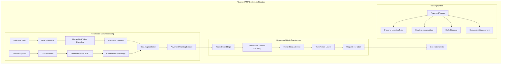

# AMT: Automated Music Transcription

[](https://github.com/username/AMT/actions/workflows/ci.yml)
[](https://www.python.org/downloads/)
[](https://opensource.org/licenses/MIT)
[](https://username.github.io/AMT/)

AMT is an automated music transcription system using transformer models. It converts audio recordings of music into symbolic representations (MIDI) and vice versa.

## 🚀 Quick Start

### Installation

```bash
# Clone the repository
git clone https://github.com/username/AMT.git
cd AMT

# Install the package
pip install -e .

# Install development dependencies
pip install -e ".[dev]"
```

### Running

```bash
# Process a single MIDI file
python process.py single path/to/file.mid

# Process a directory of MIDI files with advanced features
python process.py batch path/to/midi/dir --text-dir path/to/text/dir

# Continue processing from a checkpoint
python process.py continue path/to/checkpoint.json

# Train a model with hierarchical encoding
python train.py --paired-data-file data/paired_data.json --use-hierarchical-encoding
```

## 🏗️ Architecture

AMT consists of several modules:

1. **Collection**: Gathers and pre-processes MIDI and text data from various sources
2. **Processing**: Converts MIDI and text into tokenized data with hierarchical structure
3. **Training**: Trains transformer models using the processed data
4. **Generation**: Generates new music or text based on input prompts
5. **Testing**: Evaluates model performance and output quality

### Advanced Hierarchical Processing

The system now features state-of-the-art hierarchical processing for music data:

- **Multi-level Token Structure**: Represents music at bar, beat, and note levels
- **Contextual Embeddings**: Links musical elements with their textual descriptions
- **Optimized Checkpoint System**: Efficiently processes large datasets with robust error handling
- **Data Augmentation**: Automatically expands training data through musical transformations

### Hierarchical Music Transformer

Our transformer model leverages music's hierarchical structure:

- **Hierarchical Attention**: Captures relationships between musical elements at different levels
- **Relative Position Encoding**: Improves modeling of temporal relationships in music
- **Efficient Training**: Includes advanced techniques like gradient accumulation and dynamic batch sizing

## System Architecture



## 📋 Documentation

Detailed documentation is available in the [docs](docs/) directory:

- [Getting Started](docs/01_getting_started.md)
- [Data Collection](docs/02_data_collection.md)
- [Data Processing](docs/03_data_processing.md)
- [Training](docs/04_training.md)
- [Model Details](docs/05_model_deep_dive.md)
- [Checkpoint System](docs/checkpoint_system.md)

## 🛠️ Development

### Testing

```bash
# Run all tests
pytest

# Run specific test modules
pytest tests/test_midi_processor.py
```

### Contributing

Contributions are welcome! Please check our [contribution guidelines](CONTRIBUTING.md).

## 📜 License

This project is licensed under the MIT License - see the [LICENSE](LICENSE) file for details.

## 🙏 Acknowledgments

- The music21 library for MIDI processing
- Hugging Face Transformers for pre-trained models
- All contributors who have helped with the project 