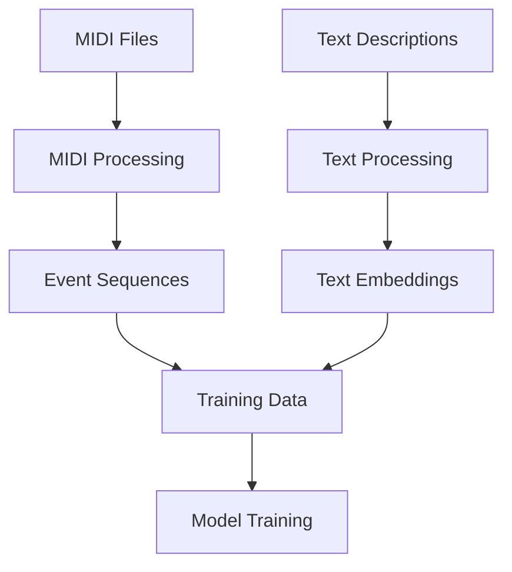
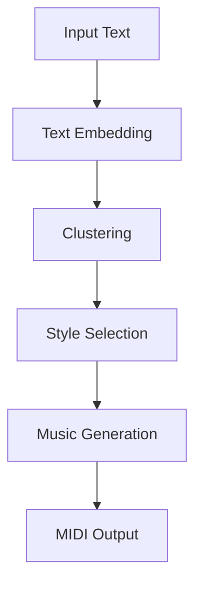

# AMT (Audio Music Transformer)

AMT là một dự án nghiên cứu về việc tạo nhạc từ mô tả văn bản, dựa trên kiến trúc Transformer. Dự án này kết hợp xử lý ngôn ngữ tự nhiên và âm nhạc để tạo ra các bản nhạc dựa trên mô tả văn bản.

## 🎵 Tính năng chính

- **Tạo nhạc từ văn bản**: Chuyển đổi mô tả văn bản thành bản nhạc MIDI
- **Xử lý đa track**: Hỗ trợ nhiều nhạc cụ và track MIDI
- **Phân tích cảm xúc**: Phân tích cảm xúc từ mô tả văn bản
- **Tạo nhạc theo phong cách**: Tạo nhạc dựa trên phong cách âm nhạc
- **Đánh giá chất lượng**: Các metrics đánh giá chất lượng bản nhạc

## 🛠 Công nghệ sử dụng

### Core Technologies
- Python 3.8+
- PyTorch
- Transformers (BERT, GPT-2)
- Mido (MIDI processing)
- NumPy
- NLTK & spaCy
- scikit-learn

### Các thư viện chuyên biệt
- torchaudio
- pandas
- matplotlib
- tqdm
- pytest

## 📦 Cài đặt

1. Clone repository:
```bash
git clone https://github.com/yourusername/AMT.git
cd AMT
```

2. Tạo môi trường ảo:
```bash
python -m venv venv
source venv/bin/activate  # Linux/Mac
venv\Scripts\activate     # Windows
```

3. Cài đặt dependencies:
```bash
pip install -r requirements.txt
```

## 🚀 Sử dụng

### 1. Chuẩn bị dữ liệu
```python
from source.data_processing.midi_processor import process_midi_files
from source.data_processing.text_processor import process_text_descriptions

# Xử lý MIDI files
midi_data = process_midi_files("path/to/midi/files")

# Xử lý mô tả văn bản
text_data = process_text_descriptions("path/to/text/descriptions")
```

### 2. Training model
```python
from source.model.training import train_model

# Training model
model = train_model(
    midi_data=midi_data,
    text_data=text_data,
    epochs=100,
    batch_size=32
)
```

### 3. Tạo nhạc
```python
from source.model.generation import MusicGenerator

# Khởi tạo generator
generator = MusicGenerator(model_path="path/to/model")

# Tạo nhạc từ văn bản
midi_file = generator.generate_from_text(
    "A happy and upbeat piano melody with a jazz influence"
)
```

## 📊 Pipeline

### Data Processing Pipeline


### Generation Pipeline


## 📁 Cấu trúc dự án

```
source/
├── data_processing/
│   ├── midi_processor.py    # MIDI processing
│   └── text_processor.py    # Text processing
├── model/
│   ├── clustering.py        # Text embedding clustering
│   ├── generation.py        # Music generation
│   └── training.py          # Model training
├── evaluation/
│   └── metrics.py           # Evaluation metrics
└── utils/
    └── data_preparation.py  # Training data preparation
```

## 🎯 Cải tiến từ bài báo gốc

### Text Processing
- Phân tích cảm xúc nâng cao
- Trích xuất từ khóa âm nhạc
- Phân loại thể loại nhạc
- Tạo embedding đa chiều

### MIDI Processing
- Hỗ trợ đa track
- Phân tích metadata chi tiết
- Theo dõi control changes
- Hỗ trợ nhiều nhạc cụ

### Model Architecture
- Gradient clipping
- Learning rate scheduling
- Mixed precision training
- Model checkpointing

### Evaluation Metrics
- Note density similarity
- Velocity similarity
- Note range similarity
- Time signature matching
- Tempo matching

## 📈 Performance

### Training
- Giảm sử dụng bộ nhớ thông qua mixed precision
- Hội tụ nhanh hơn với learning rate scheduling
- Tổng quát hóa tốt hơn với gradient clipping
- Ổn định hơn với model checkpointing

### Generation
- Matching phong cách chính xác hơn
- Xử lý tốt hơn với nhiều nhạc cụ
- Cải thiện tính nhất quán về tempo và time signature
- Kiểm soát tốt hơn các tham số generation

## 🔮 Phát triển trong tương lai

### Planned Enhancements
- Hỗ trợ generation real-time
- Chuyển đổi phong cách phức tạp hơn
- Xử lý đa nhạc cụ tốt hơn
- Metrics đánh giá nâng cao

### Research Directions
- Cải thiện cross-modal learning
- Biểu diễn phong cách tốt hơn
- Phương pháp training hiệu quả hơn
- Nâng cao chất lượng generation

## 🤝 Đóng góp

Chúng tôi rất hoan nghênh mọi đóng góp! Vui lòng đọc [CONTRIBUTING.md](CONTRIBUTING.md) để biết thêm chi tiết về quy trình đóng góp.

## 📝 License

Dự án này được cấp phép theo MIT License - xem file [LICENSE](LICENSE) để biết thêm chi tiết.

## 📧 Liên hệ

- Email: your.email@example.com
- GitHub: [your-username](https://github.com/your-username)
- Website: [your-website.com](https://your-website.com)