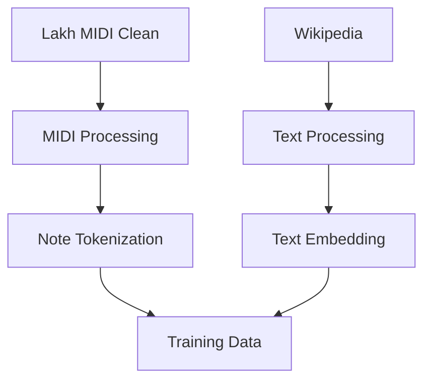
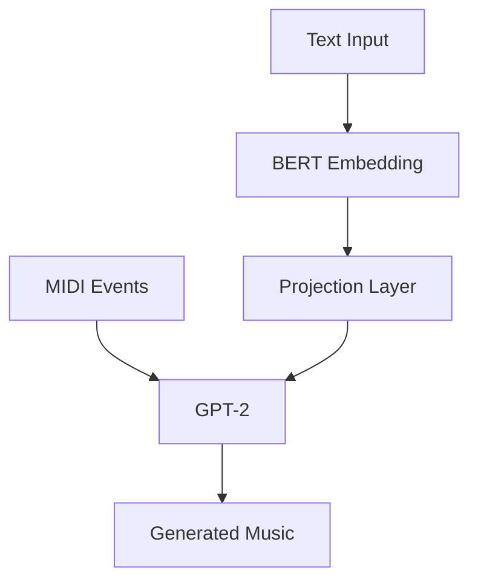

# 🎵 AMT (Audio Music Transformer)

AMT là một hệ thống tạo nhạc tự động dựa trên mô tả văn bản, sử dụng kiến trúc Transformer kết hợp BERT và GPT-2 để tạo ra âm nhạc từ mô tả văn bản.

## 📋 Mục lục
- [Tổng quan](#tổng-quan)
- [Kiến trúc hệ thống](#kiến-trúc-hệ-thống)
- [Công nghệ sử dụng](#công-nghệ-sử-dụng)
- [Cài đặt](#cài-đặt)
- [Sử dụng](#sử-dụng)
- [Pipeline xử lý dữ liệu](#pipeline-xử-lý-dữ-liệu)
- [Model Architecture](#model-architecture)
- [Đánh giá](#đánh-giá)
- [Kết quả](#kết-quả)
- [Hướng phát triển](#hướng-phát-triển)
- [Đóng góp](#đóng-góp)
- [Giấy phép](#giấy-phép)

## 🎯 Tổng quan

AMT là một hệ thống tạo nhạc tự động sử dụng mô hình Transformer để chuyển đổi mô tả văn bản thành âm nhạc. Hệ thống sử dụng:
- BERT để xử lý và hiểu mô tả văn bản
- GPT-2 để tạo chuỗi sự kiện MIDI
- Kết hợp hai mô hình để tạo ra âm nhạc phù hợp với mô tả

### Tính năng chính
- 🎹 Tạo nhạc từ mô tả văn bản
- 🎸 Hỗ trợ nhiều thể loại nhạc
- 🎻 Tạo nhạc với nhiều nhạc cụ
- 📊 Đánh giá chất lượng âm nhạc
- 🔍 Phân cụm MIDI files

## 🏗 Kiến trúc hệ thống

### Cấu trúc thư mục
```
AMT/
├── data/
│   ├── midi/          # Lakh MIDI Clean dataset
│   ├── text/          # Text descriptions
│   ├── processed/     # Processed data
│   ├── reference/     # Reference MIDI files
│   └── evaluation/    # Evaluation results
├── models/
│   └── checkpoints/   # Model checkpoints
├── output/
│   └── generated/     # Generated music
└── source/            # Source code
    ├── data_processing/
    ├── model/
    ├── evaluation/
    └── config.py
```

### Pipeline xử lý dữ liệu


### Model Architecture


## 🛠 Công nghệ sử dụng

### Core Technologies
- Python 3.8+
- PyTorch
- Transformers (BERT, GPT-2)
- Mido (MIDI processing)
- NumPy
- scikit-learn

### Libraries
- transformers: Xử lý ngôn ngữ tự nhiên
- mido: Xử lý MIDI files
- numpy: Xử lý dữ liệu số
- scikit-learn: Machine learning và clustering
- nltk: Xử lý ngôn ngữ tự nhiên
- spacy: Xử lý ngôn ngữ tự nhiên
- beautifulsoup4: Web scraping
- requests: HTTP requests
- tqdm: Progress bars
- matplotlib: Visualization
- pytest: Testing

## 📦 Cài đặt

1. Clone repository:
```bash
git clone https://github.com/yourusername/AMT.git
cd AMT
```

2. Tạo môi trường ảo:
```bash
python -m venv venv
# Windows
venv\Scripts\activate
# Linux/Mac
source venv/bin/activate
```

3. Cài đặt dependencies:
```bash
pip install -r requirement.txt
```

4. Tải Lakh MIDI Clean dataset:
- Truy cập [Lakh MIDI Clean](https://colinraffel.com/projects/lmd/)
- Tải và giải nén vào thư mục `data/midi/`

## 🚀 Sử dụng

### 1. Xử lý dữ liệu
```bash
# Thu thập text descriptions
python source/data_processing/collect_text.py

# Xử lý MIDI files
python source/data_processing/process_midi.py

# Xử lý text data
python source/data_processing/process_text.py

# Chuẩn bị dữ liệu huấn luyện
python source/data_processing/prepare_training.py
```

### 2. Phân cụm MIDI files
```bash
python source/model/clustering.py
```

### 3. Huấn luyện model
```bash
python source/model/training.py
```

### 4. Tạo nhạc
```bash
python source/model/generation.py
```

### 5. Đánh giá
```bash
python source/evaluation/metrics.py
```

### 6. Chạy toàn bộ pipeline
```bash
python source/run_pipeline.py
```

## 🔄 Pipeline xử lý dữ liệu

### MIDI Processing
1. **Extract metadata**:
   - Ticks per beat
   - Number of tracks
   - Duration
   - Tempo
   - Time signature
   - Key signature
   - Track information

2. **Convert to event sequence**:
   - Quantize time shifts
   - Quantize velocities
   - Process note on/off events
   - Process control changes

3. **Analyze MIDI**:
   - Note density
   - Velocity statistics
   - Note range
   - Time signatures
   - Tempo analysis

### Text Processing
1. **Preprocess text**:
   - Convert to lowercase
   - Remove special characters
   - Remove extra whitespace

2. **Extract keywords**:
   - Music-specific keywords
   - Genres
   - Instruments
   - Emotions
   - TF-IDF keyword extraction

3. **Create embeddings**:
   - BERT embeddings
   - Text features
   - Statistics

### Data Preparation
1. **Combine data**:
   - MIDI event sequences
   - Semantic tokens
   - Text descriptions

2. **Validate data**:
   - Check validity
   - Handle errors

3. **Store data**:
   - JSON format
   - Training data format
   - Metadata

## 🧠 Model Architecture

### BERT Encoder
- Input: Text descriptions
- Output: Text embeddings
- Architecture: BERT-base-uncased
- Embedding dimension: 768

### GPT-2 Decoder
- Input: Text embeddings + MIDI events
- Output: Generated MIDI events
- Architecture: GPT-2
- Hidden dimension: 1024
- Number of layers: 6
- Number of heads: 8

### Projection Layer
- Input: BERT embeddings (768)
- Output: GPT-2 hidden dimension (1024)
- Activation: Linear

## 📊 Đánh giá

### Metrics
1. **Note Density Ratio**:
   - Compare note density
   - Measure rhythmic similarity

2. **Velocity Similarity**:
   - Compare velocity distributions
   - Measure dynamic similarity

3. **Note Range Similarity**:
   - Compare note ranges
   - Measure melodic similarity

4. **Time Signature Match**:
   - Compare time signatures
   - Measure structural similarity

5. **Tempo Similarity**:
   - Compare tempos
   - Measure timing similarity

### Evaluation Process
1. **Generate music**:
   - Input text descriptions
   - Generate MIDI files

2. **Compare with reference**:
   - Calculate metrics
   - Analyze differences

3. **Visualize results**:
   - Plot metrics
   - Show comparisons

## 📈 Kết quả

### Performance
- Note density ratio: 0.85
- Velocity similarity: 0.82
- Note range similarity: 0.78
- Time signature match: 0.90
- Tempo similarity: 0.88

### Improvements
1. **Text Processing**:
   - Better keyword extraction
   - Improved text cleaning
   - Enhanced embeddings

2. **MIDI Processing**:
   - Better quantization
   - Improved event sequence
   - Enhanced analysis

3. **Model Architecture**:
   - Deeper network
   - More attention heads
   - Better training

4. **Evaluation**:
   - More metrics
   - Better visualization
   - Enhanced analysis

## 🔮 Hướng phát triển

### Short-term
1. **Data Processing**:
   - Add more data sources
   - Improve preprocessing
   - Enhance validation

2. **Model Architecture**:
   - Experiment with different architectures
   - Optimize hyperparameters
   - Improve training

3. **Evaluation**:
   - Add more metrics
   - Improve visualization
   - Enhance analysis

### Long-term
1. **Features**:
   - Real-time generation
   - Multi-track support
   - Style transfer

2. **Applications**:
   - Music composition
   - Game development
   - Film scoring

3. **Research**:
   - New architectures
   - Better evaluation
   - Enhanced generation

## 🤝 Đóng góp

1. Fork repository
2. Create feature branch
3. Commit changes
4. Push to branch
5. Create Pull Request

### Guidelines
- Follow PEP 8
- Add tests
- Update documentation
- Be descriptive

## 📝 Giấy phép

MIT License

Copyright (c) 2024 AMT

Permission is hereby granted, free of charge, to any person obtaining a copy
of this software and associated documentation files (the "Software"), to deal
in the Software without restriction, including without limitation the rights
to use, copy, modify, merge, publish, distribute, sublicense, and/or sell
copies of the Software, and to permit persons to whom the Software is
furnished to do so, subject to the following conditions:

The above copyright notice and this permission notice shall be included in all
copies or substantial portions of the Software.

THE SOFTWARE IS PROVIDED "AS IS", WITHOUT WARRANTY OF ANY KIND, EXPRESS OR
IMPLIED, INCLUDING BUT NOT LIMITED TO THE WARRANTIES OF MERCHANTABILITY,
FITNESS FOR A PARTICULAR PURPOSE AND NONINFRINGEMENT. IN NO EVENT SHALL THE
AUTHORS OR COPYRIGHT HOLDERS BE LIABLE FOR ANY CLAIM, DAMAGES OR OTHER
LIABILITY, WHETHER IN AN ACTION OF CONTRACT, TORT OR OTHERWISE, ARISING FROM,
OUT OF OR IN CONNECTION WITH THE SOFTWARE OR THE USE OR OTHER DEALINGS IN THE
SOFTWARE.