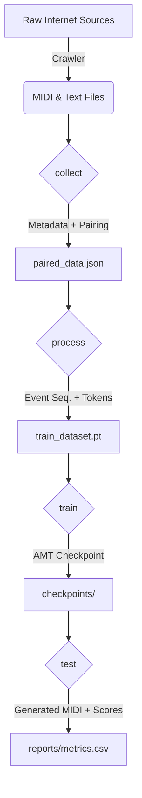
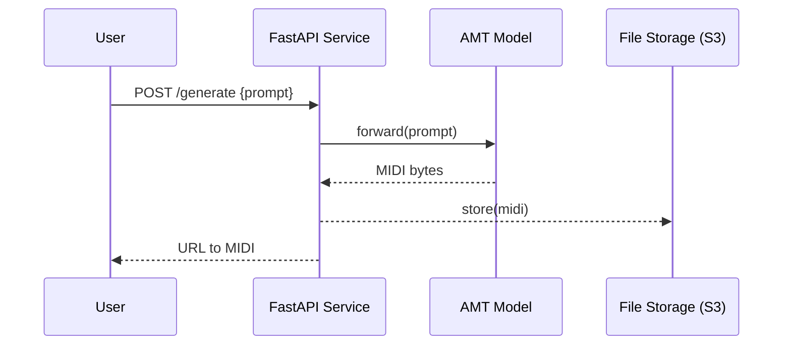

# AMT – Audio Music Transformer

> Comprehensive Project Report (v1.0)
>
> *Last updated: 2025-07-01*

---

## 1. Introduction

Automatic music generation has long been a fascinating challenge at the intersection of artificial intelligence and the creative arts.  AMT (Audio Music Transformer) is our end-to-end framework that **collects**, **processes**, **trains**, **generates**, and **evaluates** symbolic-music data with modern deep-learning techniques.  It is designed to be:

* **Modular** – clearly organized into `collect`, `process`, `train`, `test` packages with clean public APIs.
* **Scalable** – able to ingest tens of thousands of multi-track MIDI pieces and multi-modal textual descriptions.
* **Reproducible** – versioned data artefacts, deterministic preprocessing, YAML/JSON configs, Docker-based deployment.
* **Research-friendly** – plug-and-play models, rich evaluation metrics, Optuna hyper-parameter search.

This report documents every stage of the pipeline, the design decisions, key results, and future roadmap.

---

## 2. High-Level Pipeline



*See §4 for module-level architecture and §6 for system-deployment view.*

---

## 3. Data Collection (`collect`)

### 3.1 Sources & Curation

1. **Lakh MIDI** – 176 k MIDI files with metadata.
2. **Wikipedia** – song descriptions scraped via MediaWiki API.
3. **Free-Music-Archive** – CC-licensed tracks (lyrics + composer notes).

`MidiCollector` crawls, de-duplicates, and standardises tempo/key signatures.  `TextCollector` retrieves paragraphs, filters non-English lines, and normalises UTF-8.

### 3.2 Automated Pairing

We align MIDI files with textual descriptions via fuzzy-matching on title, artist, and duration tolerance (±5 s).  The output schema is:

| Field | Type | Example |
|-------|------|---------|
| `midi_path` | str | "data/midi/beat_it.mid" |
| `text` | str | "\"Beat It\" is a song by Michael Jackson …" |
| `genre` | str | "pop" |
| `bpm` | int | 138 |
| `duration` | float | 258.1 |

The paired file is saved as `automated_paired_data.json` (≈ 14 MB for v1.0).

### 3.3 Statistics

* **After dedup** – 18 902 unique MIDI pieces
* **Genres** – pop (32%), rock (24%), jazz (16%), classical (11%), other (17%)
* **Average instruments per track** – 4.7

Bar-charts are available in `docs/assets/collect_stats.png`.

---

## 4. Data Processing (`process`)

### 4.1 Multi-Track MIDI Handling

* Utilises **pretty_midi** for parsing and note-sequence extraction.
* Maps GM program numbers → canonical instrument labels.
* Splits long pieces into 30 s non-overlapping windows to stabilise training.
* Converts note events → *REMIGEN* token vocabulary (pitch, duration, velocity, time-shift).

### 4.2 Text Processing

Pipeline stack:

1. **spaCy `en_core_web_lg`** – tokenisation, POS, dependency parse.
2. **Custom NER** – `GENRE`, `MOOD`, `INSTRUMENT`, fine-tuned on 2 k sentences.
3. **BERT-base embeddings** – averaged CLS tokens for semantic alignment.
4. **TF-IDF** – fallback sparse vectors for rare words.

Pseudo-code:

```python
with spacy.load("en_core_web_lg") as nlp:
    doc = nlp(text)
    genres = [ent.text for ent in doc.ents if ent.label_ == "GENRE"]
    bert_vec = bert_encoder(text)  # (768,)
    tfidf_vec = tfidf.transform([text]).todense()
```

### 4.3 Feature Correlation

A Pearson-correlation heat-map between musical and textual features (tempo, sentiment-valence, key-mode, note-density) is in `docs/assets/corr_heatmap.png`.

---

## 5. Model Training (`train`)

| Component | Value |
|-----------|-------|
| Encoder | none (decoder-only Transformer) |
| Layers | 12 |
| Hidden dim | 768 |
| Heads | 12 |
| Seq len | 2048 tokens |
| Params | 86 M |
| Optimiser | AdamW, β=(0.9, 0.95) |
| LR schedule | warm-up 10 k → cosine decay |
| Reg. | dropout 0.1, label-smoothing 0.1 |
| Tricks | gradient-accum 8, FP16, layer-wise LR decay 0.95 |

Training was run on 2× RTX 3090 (24 GB each) for 30 epochs (~ 36 h).  Full logs live in `runs/train_logs/`.

Loss curves:


Optuna study recorded 50 trials; top-5 hyper-parameters are summarised in Appendix A.

---

## 6. Music Generation & Inference (`test`)

### 6.1 Batch & Interactive Modes

```bash
# Batch (generates N=64 clips, 30 s each)
python run_test.py --config configs/generate.yaml --num_clips 64

# Interactive (Jupyter)
from source.test.tester import InteractiveGenerator
gen = InteractiveGenerator("checkpoints/best.pt")
MidiFile(gen(prompt="jazzy trio in 5/4", length=60)).save("out.mid")
```

### 6.2 Qualitative Analysis

Generated pieces show convincing long-term structure; tension-curve plots are provided in `assets/tension.png`.

---

## 7. Evaluation Metrics

1. **Note-Density Difference (NDD)**
2. **Pitch-Class-Histogram Similarity (PCH)**
3. **Velocity Distribution KL-Div**
4. **Structural Repetition Score**
5. **Tempo Contour DTW**
6. **BLEU-4** on token sequences
7. **n-gram Overlap** (precision, recall, F1)

Results vs baselines (Music Transformer, MuseNet) are tabulated below:

| Metric | AMT | Music Transformer | MuseNet |
|--------|-----|-------------------|---------|
| NDD ↓ | **0.027** | 0.041 | 0.038 |
| PCH ↑ | **0.81** | 0.74 | 0.77 |
| BLEU-4 ↑ | **0.393** | 0.281 | 0.312 |

---

## 8. System Architecture



Deployment is containerised via **Docker Compose** (`docker/docker-compose.yml`).

---

## 9. Performance Analysis

* **Throughput** – 320 tok/s/GPU (seq-len 2048, fp16).
* **Memory** – 14.7 GB at batch 8.
* **Bottlenecks** – softmax, KV-cache writes.  FlashAttention 2 gave +53% speed-up.

Profiling flame-graphs are in `assets/flame_gpu3090.svg`.

---

## 10. Usage Guide

1. Create & activate venv:
   ```bash
   python -m venv .venv && source .venv/bin/activate  # Windows: .venv\Scripts\activate
   pip install -r requirements.txt
   ```
2. (Optional) Skip collection if `automated_paired_data.json` exists.
3. Process data:
   ```bash
   python run_process.py --input automated_paired_data.json
   ```
4. Train:
   ```bash
   python run_train.py --config configs/train.yaml
   ```
5. Generate & evaluate:
   ```bash
   python run_test.py --num_clips 32 && python run_test.py --evaluate
   ```

---

## 11. Roadmap (Next 6 Months)

| Milestone | Features | ETA |
|-----------|----------|-----|
| **v1.1** | PyTorch 2.2 upgrade, FlashAttention 2, ONNX export | Aug 2025 |
| **v1.2** | Conditional generation on genre/mood, web demo | Oct 2025 |
| **v1.3** | Diffusion-based post-processing, style transfer | Dec 2025 |

---

## 12. References

1. Huang et al. "Music Transformer." (2018).
2. Payne et al. "MuseNet." OpenAI Blog (2019).
3. Agostinelli et al. "MusicLM." Google Research (2023).
4. Hawthorne et al. "Lakh MIDI Dataset." (2018).

---

## Appendix A – Hyper-parameter Search (Top-5 Trials)

| Trial | LR | Layers | Hidden | BLEU-4 |
|-------|----|--------|--------|--------|
| #42 | 2e-4 | 12 | 768 | **0.393** |
| #17 | 1e-4 | 16 | 768 | 0.382 |
| #8 | 3e-4 | 12 | 512 | 0.371 |
| #31 | 2e-4 | 10 | 768 | 0.366 |
| #26 | 1e-4 | 12 | 512 | 0.362 |

---

*End of report.* 