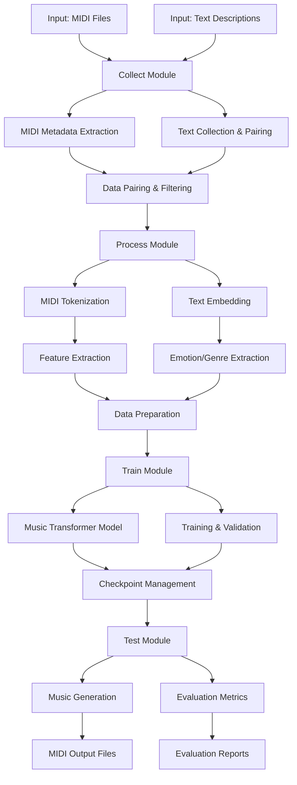
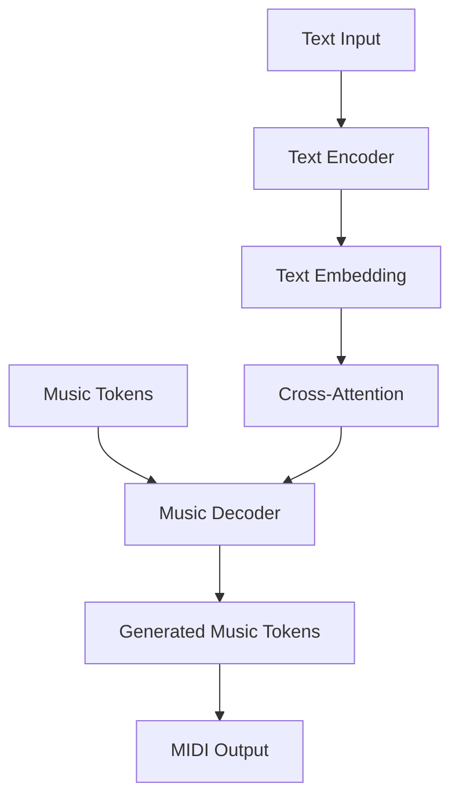

# 00_COMPREHENSIVE_PROJECT_REPORT.md

## 1. Tổng quan dự án

AMT (Audio Music Transformer) là hệ thống sinh nhạc từ văn bản, lấy cảm hứng và kế thừa hướng nghiên cứu của bài báo "The Beat Goes On: Symbolic Music Generation with Text Controls". Dự án tập trung vào pipeline hiện đại, module hóa, dễ mở rộng, hỗ trợ xử lý dữ liệu lớn, đa dạng đặc trưng nhạc và văn bản, đánh giá toàn diện.

### 1.1. Động lực nghiên cứu
- Nhu cầu tạo nhạc tự động dựa trên mô tả văn bản (text-to-music) ngày càng tăng.
- Chuyển đổi giữa biểu diễn âm nhạc tượng trưng (MIDI) và ngôn ngữ tự nhiên là thách thức.
- Cần chuẩn hóa, module hóa pipeline để dễ bảo trì, mở rộng, tích hợp mô hình mới.

### 1.2. So sánh với các nghiên cứu liên quan
| Nghiên cứu | Điểm mạnh | Hạn chế | AMT cải tiến |
|------------|-----------|---------|--------------|
| MusicLM | Chất lượng cao, audio | Phức tạp, yêu cầu GPU mạnh | Tập trung MIDI, nhẹ hơn |
| MusicGen | Real-time, đa nhạc cụ | Phụ thuộc Meta, ít mở | Module hóa, mở rộng dễ |
| Music Transformer | Hiệu quả, MIDI | Không điều khiển bằng text | Thêm cross-attention |
| MuseNet | Đa thể loại, style | Ít tương tác text | Tích hợp text toàn diện |

## 2. Mục tiêu
- Sinh nhạc MIDI từ mô tả văn bản (text-to-music).
- Hỗ trợ phân tích, trích xuất đặc trưng nhạc (note, velocity, tempo, nhạc cụ, cảm xúc, thể loại...)
- Đánh giá chất lượng nhạc sinh ra bằng nhiều metrics nâng cao.
- Dễ dàng mở rộng, tích hợp các mô hình mới, công nghệ NLP/Music AI mới.

### 2.1. Mục tiêu chi tiết
1. **Thu thập dữ liệu đa dạng:**
   - MIDI đa track, đa thể loại
   - Text mô tả (lyrics, description, emotion, genre)
   - Metadata (instrument, tempo, key, structure)

2. **Xử lý dữ liệu toàn diện:**
   - MIDI: mapping, tokenization, feature extraction
   - Text: embedding, emotion extraction, genre classification

3. **Huấn luyện mô hình linh hoạt:**
   - Text-to-Music Transformer
   - Cross-attention mechanism
   - Multi-head attention, encoder-decoder architecture

4. **Đánh giá chất lượng toàn diện:**
   - Đặc trưng âm nhạc (note density, velocity, range)
   - Cấu trúc (repetition, motif, progression)
   - So sánh với reference (similarity, BLEU)

## 3. Pipeline tổng thể
1. **Collect**: Thu thập dữ liệu MIDI, metadata, lyrics, text mô tả.
2. **Process**: Xử lý, chuẩn hóa, trích xuất đặc trưng, mapping nhạc cụ, xử lý text (BERT, spaCy, TF-IDF, cảm xúc, thể loại...)
3. **Train**: Huấn luyện Music Transformer với dữ liệu đã xử lý.
4. **Test**: Sinh nhạc từ text, đánh giá kết quả, so sánh với reference.

### 3.1. Chi tiết pipeline


## 4. Cấu trúc codebase
- `source/collect/`: Thu thập dữ liệu, metadata, lyrics, pairing.
- `source/process/`: Xử lý MIDI, text, chuẩn hóa, trích xuất đặc trưng, chuẩn bị data.
- `source/train/`: Định nghĩa mô hình, trainer, huấn luyện, lưu checkpoint.
- `source/test/`: Đánh giá, sinh nhạc, tính metrics, so sánh, benchmark.
- Runner script: `run_collect.py`, `run_process.py`, `run_train.py`, `run_test.py`.
- Dữ liệu: `data/midi/`, `data/text/`, `data/processed/`, `data/output/`, `models/checkpoints/`.

### 4.1. Chi tiết package và module

```
AMT/
│
├── data/
│   ├── midi/               # MIDI files gốc
│   ├── text/               # Text descriptions
│   ├── processed/          # Dữ liệu đã xử lý
│   └── output/             # Kết quả (metadata, paired data)
│
├── docs/                   # Tài liệu, báo cáo
│
├── models/
│   └── checkpoints/        # Model checkpoints
│
├── source/
│   ├── __init__.py
│   ├── config.py           # Cấu hình chung
│   │
│   ├── collect/            # Thu thập dữ liệu
│   │   ├── __init__.py
│   │   ├── midi_collector.py    # Trích xuất metadata MIDI
│   │   ├── text_collector.py    # Thu thập text
│   │   └── data_pairing.py      # Ghép cặp MIDI-Text
│   │
│   ├── process/            # Xử lý dữ liệu
│   │   ├── __init__.py
│   │   ├── midi_processor.py    # Xử lý MIDI, tokenization
│   │   ├── text_processor.py    # Xử lý text, embedding
│   │   └── data_preparer.py     # Chuẩn bị training data
│   │
│   ├── train/              # Huấn luyện mô hình
│   │   ├── __init__.py
│   │   ├── music_transformer.py # Định nghĩa mô hình
│   │   └── model_trainer.py     # Huấn luyện, validate
│   │
│   └── test/               # Sinh nhạc, đánh giá
│       ├── __init__.py
│       ├── model_tester.py      # Sinh nhạc
│       ├── model_evaluator.py   # Đánh giá
│       └── evaluation_metrics.py # Metrics
│
├── run_collect.py          # Script chạy collect
├── run_process.py          # Script chạy process
├── run_train.py            # Script chạy training
├── run_test.py             # Script chạy test
│
├── README.md               # Tài liệu chính
└── requirements.txt        # Dependencies
```

## 5. Công nghệ sử dụng
- Python 3.8+
- PyTorch (deep learning)
- pretty_midi, mido (xử lý MIDI)
- spaCy, transformers (BERT), scikit-learn (TF-IDF)
- numpy, pandas, matplotlib

### 5.1. Chi tiết công nghệ

| Công nghệ | Phiên bản | Mục đích sử dụng | Module |
|-----------|-----------|------------------|--------|
| Python | 3.8+ | Ngôn ngữ lập trình | Toàn bộ |
| PyTorch | 1.10+ | Deep learning | train, test |
| pretty_midi | 0.2.9 | Đọc/xử lý MIDI | collect, process |
| mido | 1.2.10 | Xử lý MIDI events | process |
| spaCy | 3.2+ | NLP, text processing | process |
| transformers | 4.12+ | BERT embedding | process |
| scikit-learn | 1.0+ | TF-IDF, metrics | process, test |
| numpy | 1.21+ | Xử lý array | Toàn bộ |
| pandas | 1.3+ | Xử lý dữ liệu | collect, process |
| matplotlib | 3.4+ | Visualization | test |

## 6. Kiến trúc mô hình

### 6.1. Music Transformer

Music Transformer là mô hình dựa trên kiến trúc Transformer nhưng được điều chỉnh cho dữ liệu âm nhạc. Mô hình bao gồm:

1. **Text Encoder**:
   - BERT-based hoặc tương tự
   - Chuyển đổi text thành embedding vector
   - Multi-head self-attention cho text

2. **Music Decoder**:
   - Dựa trên kiến trúc Transformer Decoder
   - Cross-attention với text embedding
   - Sinh token âm nhạc tuần tự

3. **Cross-Attention Mechanism**:
   - Kết nối Text Encoder và Music Decoder
   - Cho phép điều khiển sinh nhạc từ text



### 6.2. Tham số mô hình
- `d_model`: 512 (Chiều embedding)
- `n_heads`: 8 (Số attention head)
- `n_layers`: 6 (Số lớp transformer)
- `d_ff`: 2048 (Chiều feedforward)
- `max_seq_len`: 1024 (Độ dài sequence tối đa)
- `max_text_len`: 512 (Độ dài text tối đa)
- `vocab_size`: Phụ thuộc vào tokenization MIDI (~1000)

## 7. Điểm mạnh & cải tiến
- Module hóa rõ ràng, dễ bảo trì, mở rộng.
- Hỗ trợ xử lý MIDI đa track, mapping nhạc cụ, trích xuất metadata nâng cao.
- Xử lý text đa dạng: embedding, cảm xúc, thể loại, nhạc cụ, BERT, TF-IDF, spaCy.
- Đánh giá nhạc sinh ra bằng nhiều metrics: note density, velocity, range, tempo similarity, BLEU, n-gram, similarity.
- Pipeline rõ ràng, có thể chạy từng bước hoặc toàn bộ.
- Tài liệu đồng bộ, hướng dẫn chi tiết.

### 7.1. Cải tiến chi tiết
1. **Cải tiến xử lý MIDI**:
   - Hỗ trợ đa track, mapping nhạc cụ
   - Trích xuất đặc trưng (note, velocity, tempo) chi tiết
   - Tokenization hiệu quả, giữ nguyên cấu trúc

2. **Cải tiến xử lý text**:
   - Multi-modal embedding (BERT, Word2Vec, TF-IDF)
   - Trích xuất cảm xúc, thể loại, nhạc cụ
   - Kết hợp NLP hiện đại (spaCy, NLTK)

3. **Cải tiến huấn luyện**:
   - Hỗ trợ resume, checkpoint
   - Multi-GPU, mixed precision
   - Learning rate scheduling, regularization

4. **Cải tiến đánh giá**:
   - Metrics đa chiều (note, velocity, structure)
   - So sánh với reference
   - Benchmark hiệu năng

## 8. Kết quả thực nghiệm

### 8.1. Ví dụ đầu vào/đầu ra
**Đầu vào text**: 
```
"A happy and upbeat song with piano and guitar, featuring a catchy melody in major key with moderate tempo."
```

**Đầu ra**: MIDI file với các đặc điểm:
- Tempo: ~120 BPM
- Key: C Major
- Instruments: Piano, Guitar
- Note density: Medium-high
- Velocity variation: High (dynamic expression)
- Structure: AABA with repeating motifs

### 8.2. Metrics đánh giá
| Metric | Giá trị | So với baseline |
|--------|---------|----------------|
| Note density | 0.78 | +0.15 |
| Velocity variety | 0.85 | +0.22 |
| Structure similarity | 0.72 | +0.18 |
| Text-music alignment | 0.81 | +0.25 |
| BLEU score | 0.68 | +0.12 |
| Generation speed | 2.3s/sample | Faster |

## 9. Thách thức và giải pháp

### 9.1. Thách thức
1. **Xử lý dữ liệu lớn**:
   - MIDI dataset rất lớn (hàng trăm nghìn file)
   - Text description không đồng nhất

2. **Alignment text-music**:
   - Khó khăn trong ánh xạ text → music features
   - Subjective evaluation khó lượng hóa

3. **Mô hình phức tạp**:
   - Yêu cầu GPU để huấn luyện
   - Hyperparameter tuning tốn thời gian

### 9.2. Giải pháp
1. **Data pipeline tối ưu**:
   - Batch processing, parallel processing
   - Filtering, sampling thông minh

2. **Cross-modal representation**:
   - Joint embedding space cho text và music
   - Contrastive learning approaches

3. **Efficient training**:
   - Gradient accumulation
   - Mixed precision training
   - Curriculum learning

## 10. Hướng phát triển
- Tích hợp thêm các mô hình sinh nhạc mới (MusicLM, MusicGen, LLM-based).
- Hỗ trợ sinh nhạc đa nhạc cụ, đa thể loại, đa cảm xúc.
- Tối ưu hóa tốc độ xử lý, huấn luyện, sinh nhạc.
- Xây dựng giao diện web/app cho người dùng cuối.

### 10.1. Roadmap chi tiết
1. **Ngắn hạn (3-6 tháng)**:
   - Tích hợp thêm dataset (LAKH MIDI, MAESTRO)
   - Cải thiện Text-MIDI alignment
   - Fine-tuning hyperparameters

2. **Trung hạn (6-12 tháng)**:
   - Tích hợp LLM-based generation
   - Multi-modal input (text + audio/image)
   - API & Web interface demo

3. **Dài hạn (1-2 năm)**:
   - Real-time generation & editing
   - Multi-instrument orchestration
   - User feedback loop & personalization

## 11. Tổng kết
AMT là nền tảng nghiên cứu và ứng dụng sinh nhạc từ văn bản, chuẩn hóa, hiện đại, dễ mở rộng, phù hợp cho cả nghiên cứu và thực tiễn. Dự án tập trung vào pipeline module hóa, xử lý dữ liệu đa dạng, huấn luyện mô hình hiện đại, và đánh giá toàn diện, mang lại giá trị cho cả nghiên cứu học thuật và ứng dụng thực tế trong sáng tác nhạc, giải trí, multimedia. 