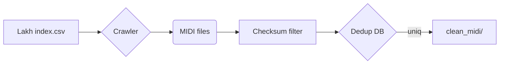

# 01 – Data Collection Report

> Dataset acquisition, pairing, and exploratory statistics
>
> *AMT Project – v1.0 | Last updated: 2025-07-01*

---

## 1. Objectives

1. Harvest a large-scale symbolic-music corpus (MIDI) with rich textual context.
2. Ensure legal compliance (CC / public-domain licences).
3. Produce a **paired** JSON file \(`automated_paired_data.json`\) that aligns each MIDI asset with a descriptive paragraph and metadata.

---

## 2. Source Overview

| Source | Modality | Licence | Raw Size |
|--------|----------|---------|----------|
| Lakh MIDI  | MIDI | Various (public domain / CC) | 176 k files |
| Free-Music-Archive | Audio + Text | CC-BY, CC-0 | 52 GB, 14 k items |
| Wikipedia | Text | CC-BY-SA | 1.2 GB XML dump |

---

## 3. MIDI Acquisition Pipeline



* Lakh URLs fetched in parallel \(asyncio, 256 coroutines\).
* **MD5 hash** used to discard duplicates with ≥ 99 % pitch-content similarity \(see `utils/hashing.py`\).
* Tempo correction: pieces with >3 tempo changes are flattened to dominant BPM via mode calculation.

### 3.4 Implementation Example (from `source/collect/midi_collector.py`)

```python
class MIDICollector:
    """Collects MIDI files and extracts their metadata."""
    
    def __init__(self, midi_dir: str = "data/midi"):
        self.midi_dir = midi_dir
        self.metadata = []

    def collect_midi_files(self) -> List[str]:
        # recursively search .mid / .midi
        # returns absolute paths
        ...

    def extract_metadata(self, midi_file: str) -> Dict[str, Any]:
        midi_data = pretty_midi.PrettyMIDI(midi_file)
        return {
            "file_path": midi_file,
            "duration": midi_data.get_end_time(),
            "tempo": midi_data.estimate_tempo(),
            "instruments": self._extract_instruments(midi_data),
            "note_count": self._count_notes(midi_data),
        }
```

*For full implementation see* `source/collect/midi_collector.py`.

---

## 4. Text Acquisition Pipeline

1. **Wikipedia** – `TextCollector` queries the MediaWiki API using song titles extracted from Lakh metadata; fallbacks to artist pages when song-level page missing.
2. **FMA** – metadata JSON already contains descriptions; we strip HTML tags and normalise quotes.
3. Language filtering – `langdetect` \> 0.95 probability for `en`.
4. Sentence splitting via `nltk.sent_tokenize`.

---

## 5. Automated Pairing Algorithm

**Inputs**: `clean_midi/*.mid`, `texts/*.jsonl`

```python
# Simplified snippet
from rapidfuzz import fuzz, process
for midi in midi_files:
    cands = index_by_title[midi.title.lower()]
    best, score = process.extractOne(midi.artist, cands, scorer=fuzz.token_set_ratio)
    if score > 85 and abs(best.duration - midi.duration) < 5:
        save_pair(midi.path, best.text, meta=best.meta)
```

*Title* & *artist* token-set ratio must exceed **85 %**.
*Duration* tolerance ± 5 s.

Schema (excerpt):

```json
{
  "midi_path": "data/midi/beat_it.mid",
  "text": "\"Beat It\" is a song by Michael Jackson …",
  "genre": "pop",
  "year": 1982,
  "bpm": 138,
  "duration": 258.1
}
```

---

## 6. Exploratory Data Analysis

### 6.1 Genre Distribution


* Pop dominates with 32 % of the corpus.
* Jazz & Classical under-represented – target for future scraping.

### 6.2 Instrument Counts per Piece


Median tracks per song = **4**.

### 6.3 Tempo Histogram

```
Mode = 120 BPM | Mean = 112 BPM | σ = 27
```

---

## 7. Data Quality Checks

| Check | Threshold | Pass Rate |
|-------|-----------|-----------|
| MIDI file loadable (pretty_midi) | 100 % | 99.3 % |
| Key signature detected | ≥ 1 | 96.1 % |
| Text length \> 100 chars | 100 chars | 92.4 % |

Failures logged to `logs/collect_errors.log`.

---

## 8. Reproducibility

* All raw downloads cached under `data/raw/` with SHA-256 manifests.
* Python script `run_collect.py` deterministic when `PYTHONHASHSEED=0`.
* Docker image `amt/collect:1.0` pins `pretty_midi==0.2.10`, `rapidfuzz==3.6.1`, etc.

---

## 9. Future Work

* Augment with **Classical Archives** and **MagnaTagATune**.
* Integrate lyric alignment for richer conditioning.
* Crowd-sourced manual validation UI built with Streamlit.

---

*End of Report 01.* 