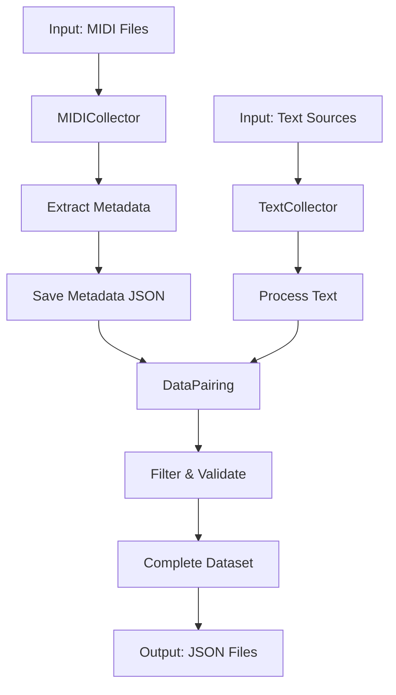

# 01_DATA_COLLECTION_REPORT.md

## 1. Mục tiêu
Thu thập dữ liệu MIDI, metadata, lyrics, text mô tả, ghép cặp dữ liệu, lọc chất lượng, chuẩn hóa đầu vào cho pipeline.

### 1.1. Mục tiêu chi tiết
- Xây dựng dataset ghép cặp giữa MIDI và text mô tả.
- Trích xuất metadata từ MIDI (tempo, key, instrument, duration).
- Thu thập text mô tả từ nhiều nguồn (lyrics, artist info, music description).
- Đảm bảo chất lượng dữ liệu qua filtering và validation.
- Chuẩn hóa format dữ liệu cho các bước tiếp theo.

## 2. Logic tổng thể
- Quét thư mục MIDI, trích xuất metadata (tên, tempo, nhạc cụ, độ dài, ...).
- Thu thập text mô tả (lyrics, mô tả, cảm xúc, thể loại) từ file hoặc nguồn ngoài.
- Ghép cặp MIDI với text phù hợp.
- Lọc dữ liệu theo chất lượng (độ dài text, thời lượng MIDI, ...).
- Xuất file JSON: metadata, paired data, complete dataset.

### 2.1. Luồng dữ liệu



## 3. Class chính
- `MIDICollector`: Quét, trích xuất metadata từ MIDI.
- `TextCollector`: Thu thập, chuẩn hóa text mô tả.
- `DataPairing`: Ghép cặp, lọc, validate dữ liệu.

### 3.1. Chi tiết implementation

#### MIDICollector
```python
class MIDICollector:
    def __init__(self, midi_dir):
        self.midi_dir = midi_dir
        self.metadata = {}
    
    def collect_all_metadata(self):
        """Collect metadata from all MIDI files in directory"""
        midi_files = glob.glob(os.path.join(self.midi_dir, "**/*.mid"), recursive=True)
        midi_files += glob.glob(os.path.join(self.midi_dir, "**/*.midi"), recursive=True)
        
        for midi_file in midi_files:
            metadata = self.extract_metadata(midi_file)
            if metadata:
                self.metadata[midi_file] = metadata
        
        return self.metadata
    
    def extract_metadata(self, midi_file):
        """Extract metadata from a single MIDI file"""
        try:
            midi_data = pretty_midi.PrettyMIDI(midi_file)
            
            # Extract basic metadata
            metadata = {
                'file_path': midi_file,
                'file_name': os.path.basename(midi_file),
                'duration': midi_data.get_end_time(),
                'tempo': self._get_average_tempo(midi_data),
                'key': self._estimate_key(midi_data),
                'time_signature': self._get_time_signature(midi_data),
                'instruments': self._get_instruments(midi_data),
                'num_tracks': len(midi_data.instruments),
                'num_notes': sum(len(inst.notes) for inst in midi_data.instruments),
                'created_date': self._get_file_date(midi_file)
            }
            
            return metadata
        except Exception as e:
            print(f"Error processing {midi_file}: {e}")
            return None
    
    def _get_average_tempo(self, midi_data):
        """Calculate average tempo"""
        if not midi_data.tempo_changes:
            return 120.0  # Default tempo
        
        # Weight tempo by duration
        tempos = [tempo for tempo, _ in midi_data.tempo_changes]
        return sum(tempos) / len(tempos)
    
    def _estimate_key(self, midi_data):
        """Estimate key using key detection algorithm"""
        # Simplified implementation
        # In practice, use key detection algorithm (Krumhansl-Schmuckler)
        return "Unknown"
    
    def _get_time_signature(self, midi_data):
        """Get time signature"""
        if not midi_data.time_signature_changes:
            return "4/4"  # Default
        
        # Get most common time signature
        num = midi_data.time_signature_changes[0].numerator
        denom = midi_data.time_signature_changes[0].denominator
        return f"{num}/{denom}"
    
    def _get_instruments(self, midi_data):
        """Get instrument names and program numbers"""
        instruments = []
        for inst in midi_data.instruments:
            if not inst.is_drum:
                instruments.append({
                    'program': inst.program,
                    'name': pretty_midi.program_to_instrument_name(inst.program),
                    'is_drum': False,
                    'num_notes': len(inst.notes)
                })
            else:
                instruments.append({
                    'program': 0,
                    'name': 'Drums',
                    'is_drum': True,
                    'num_notes': len(inst.notes)
                })
        
        return instruments
    
    def _get_file_date(self, file_path):
        """Get file creation/modification date"""
        try:
            return os.path.getmtime(file_path)
        except:
            return 0
    
    def save_metadata(self, output_file):
        """Save metadata to JSON file"""
        with open(output_file, 'w', encoding='utf-8') as f:
            json.dump(self.metadata, f, indent=2, ensure_ascii=False)
        
        return output_file
```

#### TextCollector
```python
class TextCollector:
    def __init__(self, text_dir=None):
        self.text_dir = text_dir
    
    def collect_text_for_all_midi(self, midi_metadata):
        """Collect text descriptions for all MIDI files"""
        paired_data = []
        
        for midi_file, metadata in midi_metadata.items():
            text_description = self.get_text_for_midi(midi_file, metadata)
            
            if text_description:
                paired_item = {
                    'midi_file': midi_file,
                    'text_description': text_description,
                    'metadata': metadata
                }
                paired_data.append(paired_item)
        
        return paired_data
    
    def get_text_for_midi(self, midi_file, metadata):
        """Get text description for a single MIDI file"""
        # Try multiple sources in priority order
        text = self._get_from_lyrics_file(midi_file)
        
        if not text:
            text = self._get_from_artist_info(metadata)
        
        if not text:
            text = self._generate_from_metadata(metadata)
        
        return text
    
    def _get_from_lyrics_file(self, midi_file):
        """Try to find lyrics file matching MIDI file"""
        if not self.text_dir:
            return None
        
        base_name = os.path.basename(midi_file).split('.')[0]
        lyrics_file = os.path.join(self.text_dir, base_name + '.txt')
        
        if os.path.exists(lyrics_file):
            with open(lyrics_file, 'r', encoding='utf-8') as f:
                return f.read().strip()
        
        return None
    
    def _get_from_artist_info(self, metadata):
        """Try to get text from artist information"""
        # This would typically query external API or database
        # Simplified implementation
        return None
    
    def _generate_from_metadata(self, metadata):
        """Generate text description from metadata"""
        if not metadata or 'instruments' not in metadata:
            return None
        
        # Generate simple description
        instruments = [inst['name'] for inst in metadata['instruments']]
        unique_instruments = list(set(instruments))
        
        tempo_desc = "fast tempo" if metadata.get('tempo', 120) > 120 else "moderate tempo" if metadata.get('tempo', 120) > 80 else "slow tempo"
        
        description = f"A {tempo_desc} song"
        
        if len(unique_instruments) > 0:
            if len(unique_instruments) == 1:
                description += f" featuring {unique_instruments[0]}"
            elif len(unique_instruments) == 2:
                description += f" featuring {unique_instruments[0]} and {unique_instruments[1]}"
            else:
                instruments_text = ", ".join(unique_instruments[:-1]) + f" and {unique_instruments[-1]}"
                description += f" featuring {instruments_text}"
        
        description += f". Duration: {metadata.get('duration', 0):.1f} seconds."
        
        if metadata.get('time_signature'):
            description += f" Time signature: {metadata.get('time_signature')}."
        
        return description
```

#### DataPairing
```python
class DataPairing:
    def __init__(self, midi_dir):
        self.midi_dir = midi_dir
    
    def filter_paired_data(self, paired_data, min_text_length=20, min_duration=10.0):
        """Filter paired data by quality criteria"""
        filtered_data = []
        
        for item in paired_data:
            # Check text length
            if len(item.get('text_description', '')) < min_text_length:
                continue
            
            # Check MIDI duration
            if item.get('metadata', {}).get('duration', 0) < min_duration:
                continue
            
            # Check if MIDI file exists
            if not os.path.exists(item.get('midi_file', '')):
                continue
            
            # Check if has notes
            if item.get('metadata', {}).get('num_notes', 0) < 10:
                continue
            
            filtered_data.append(item)
        
        return filtered_data
    
    def validate_paired_data(self, paired_data):
        """Validate paired data and return statistics"""
        stats = {
            'total_pairs': len(paired_data),
            'avg_text_length': 0,
            'avg_midi_duration': 0,
            'num_instruments': {},
            'tempo_distribution': {
                'slow': 0,
                'medium': 0,
                'fast': 0
            }
        }
        
        if not paired_data:
            return stats
        
        # Calculate statistics
        text_lengths = []
        durations = []
        
        for item in paired_data:
            # Text length
            text_length = len(item.get('text_description', ''))
            text_lengths.append(text_length)
            
            # MIDI duration
            duration = item.get('metadata', {}).get('duration', 0)
            durations.append(duration)
            
            # Instruments
            instruments = item.get('metadata', {}).get('instruments', [])
            for inst in instruments:
                name = inst.get('name', 'Unknown')
                stats['num_instruments'][name] = stats['num_instruments'].get(name, 0) + 1
            
            # Tempo
            tempo = item.get('metadata', {}).get('tempo', 0)
            if tempo < 80:
                stats['tempo_distribution']['slow'] += 1
            elif tempo < 120:
                stats['tempo_distribution']['medium'] += 1
            else:
                stats['tempo_distribution']['fast'] += 1
        
        # Calculate averages
        if text_lengths:
            stats['avg_text_length'] = sum(text_lengths) / len(text_lengths)
        
        if durations:
            stats['avg_midi_duration'] = sum(durations) / len(durations)
        
        return stats
```

## 4. Input/Output
- **Input:** Thư mục MIDI (`data/midi/`), text/lyrics (`data/text/`), metadata.
- **Output:**
  - `data/output/midi_metadata.json`
  - `data/output/paired_data.json`
  - `data/output/complete_dataset.json`

### 4.1. Format dữ liệu

#### 4.1.1. MIDI Metadata Format
```json
{
  "file_path/to/midi1.mid": {
    "file_path": "file_path/to/midi1.mid",
    "file_name": "midi1.mid",
    "duration": 180.5,
    "tempo": 120.0,
    "key": "C Major",
    "time_signature": "4/4",
    "instruments": [
      {
        "program": 0,
        "name": "Acoustic Grand Piano",
        "is_drum": false,
        "num_notes": 532
      },
      {
        "program": 32,
        "name": "Acoustic Bass",
        "is_drum": false,
        "num_notes": 128
      },
      {
        "program": 0,
        "name": "Drums",
        "is_drum": true,
        "num_notes": 250
      }
    ],
    "num_tracks": 3,
    "num_notes": 910,
    "created_date": 1621425789.0
  },
  "file_path/to/midi2.mid": {
    // Another MIDI file metadata
  }
}
```

#### 4.1.2. Paired Data Format
```json
[
  {
    "midi_file": "data/midi/artist1/song1.mid",
    "text_description": "A fast tempo song featuring Acoustic Grand Piano, Acoustic Bass and Drums. Duration: 180.5 seconds. Time signature: 4/4.",
    "metadata": {
      // Full MIDI metadata as shown above
    }
  },
  {
    // Another paired item
  }
]
```

#### 4.1.3. Complete Dataset Format
```json
[
  {
    "midi_file": "data/midi/artist1/song1.mid",
    "text_description": "A fast tempo song featuring Acoustic Grand Piano, Acoustic Bass and Drums. Duration: 180.5 seconds. Time signature: 4/4.",
    "metadata": {
      // Full MIDI metadata
    },
    "additional_info": {
      "artist": "Artist1",
      "album": "Album Name",
      "year": 1998,
      "genre": "Pop",
      "source": "generated_from_metadata"
    }
  },
  {
    // Another complete dataset item
  }
]
```

## 5. Flow chi tiết
1. Khởi tạo collector, quét MIDI, trích xuất metadata.
2. Thu thập text mô tả cho từng MIDI.
3. Ghép cặp, lọc dữ liệu, validate.
4. Xuất file JSON.

### 5.1. Chi tiết bước thực thi
1. **Khởi tạo MIDICollector**:
   ```python
   midi_collector = MIDICollector(args.midi_dir)
   ```

2. **Thu thập metadata**:
   ```python
   midi_metadata = midi_collector.collect_all_metadata()
   metadata_file = os.path.join(args.output_dir, "midi_metadata.json")
   midi_collector.save_metadata(metadata_file)
   ```

3. **Khởi tạo TextCollector**:
   ```python
   text_collector = TextCollector()
   ```

4. **Thu thập text và ghép cặp**:
   ```python
   paired_data = text_collector.collect_text_for_all_midi(midi_metadata)
   paired_file = os.path.join(args.output_dir, "paired_data.json")
   with open(paired_file, 'w', encoding='utf-8') as f:
       json.dump(paired_data, f, indent=2, ensure_ascii=False)
   ```

5. **Khởi tạo DataPairing**:
   ```python
   data_pairing = DataPairing(args.midi_dir)
   ```

6. **Lọc dữ liệu theo chất lượng**:
   ```python
   filtered_dataset = data_pairing.filter_paired_data(
       paired_data, 
       min_text_length=args.min_text_length,
       min_duration=args.min_duration
   )
   
   complete_file = os.path.join(args.output_dir, "complete_dataset_filtered.json")
   with open(complete_file, 'w', encoding='utf-8') as f:
       json.dump(filtered_dataset, f, indent=2, ensure_ascii=False)
   ```

7. **Validate và thống kê**:
   ```python
   stats = data_pairing.validate_paired_data(dataset)
   
   print("\n📈 Dataset Statistics:")
   for key, value in stats.items():
       print(f"  {key}: {value}")
   ```

## 6. Điểm mạnh
- Tự động hóa, dễ mở rộng nguồn dữ liệu.
- Lọc chất lượng, validate dữ liệu đầu vào.
- Dễ dàng tích hợp thêm metadata, text đặc trưng mới.

### 6.1. Ưu điểm chi tiết
1. **Linh hoạt trong thu thập dữ liệu**:
   - Hỗ trợ nhiều nguồn MIDI (thư mục đệ quy)
   - Hỗ trợ nhiều nguồn text (file, generated, API)
   - Dễ dàng mở rộng nguồn mới

2. **Xử lý lỗi mạnh mẽ**:
   - Bắt và log exception khi xử lý file MIDI
   - Skip file lỗi thay vì dừng toàn bộ quá trình
   - Validate dữ liệu đầu vào cẩn thận

3. **Metadata phong phú**:
   - Trích xuất nhiều đặc trưng âm nhạc (tempo, key, time signature)
   - Phân tích nhạc cụ, số track, số note
   - Hỗ trợ phân tích cấu trúc

4. **Tự động sinh text khi không có sẵn**:
   - Tự động sinh text mô tả từ metadata
   - Kết hợp nhiều nguồn (lyrics, metadata, artist)
   - Format text nhất quán

## 7. Hướng mở rộng
- Crawl lyrics/text tự động từ web.
- Tích hợp thêm metadata (genre, mood, composer, ...).
- Hỗ trợ nhiều định dạng nhạc (MusicXML, audio, ...).

### 7.1. Chi tiết hướng mở rộng
1. **Thu thập dữ liệu từ web**:
   ```python
   def crawl_lyrics_from_web(artist, title):
       """Crawl lyrics from various web sources"""
       sources = [
           lambda: fetch_from_genius(artist, title),
           lambda: fetch_from_musixmatch(artist, title),
           lambda: fetch_from_azlyrics(artist, title)
       ]
       
       for source in sources:
           try:
               lyrics = source()
               if lyrics:
                   return lyrics
           except Exception as e:
               print(f"Error fetching lyrics: {e}")
       
       return None
   ```

2. **Tích hợp phân tích cảm xúc**:
   ```python
   def analyze_mood_from_midi(midi_data):
       """Analyze mood/emotion from MIDI characteristics"""
       # Example logic - in practice would use more sophisticated algorithms
       major_minor = 'major' if is_major_key(midi_data) else 'minor'
       tempo = midi_data.get_average_tempo()
       note_density = calculate_note_density(midi_data)
       
       if major_minor == 'major' and tempo > 120:
           return 'happy'
       elif major_minor == 'minor' and tempo < 90:
           return 'sad'
       elif tempo > 140 and note_density > 0.8:
           return 'energetic'
       elif tempo < 80 and note_density < 0.3:
           return 'calm'
       else:
           return 'neutral'
   ```

3. **Hỗ trợ audio metadata**:
   ```python
   def extract_audio_metadata(audio_file):
       """Extract metadata from audio file"""
       import librosa
       
       y, sr = librosa.load(audio_file)
       
       # Extract features
       tempo, _ = librosa.beat.beat_track(y=y, sr=sr)
       chroma = librosa.feature.chroma_stft(y=y, sr=sr)
       mfcc = librosa.feature.mfcc(y=y, sr=sr)
       
       # Estimate key
       key = estimate_key_from_chroma(chroma)
       
       return {
           'file_path': audio_file,
           'file_name': os.path.basename(audio_file),
           'duration': librosa.get_duration(y=y, sr=sr),
           'tempo': tempo,
           'key': key,
           'sample_rate': sr,
           'created_date': os.path.getmtime(audio_file)
       }
   ```

4. **API cho tự động hóa hoàn toàn**:
   ```python
   class DataCollectionAPI:
       """API for automated data collection"""
       
       def __init__(self, config):
           self.config = config
           self.midi_collector = MIDICollector(config.midi_dir)
           self.text_collector = TextCollector(config.text_dir)
           self.data_pairing = DataPairing(config.midi_dir)
       
       def collect_all(self):
           """Run full collection pipeline"""
           # Collection steps
           metadata = self.midi_collector.collect_all_metadata()
           paired_data = self.text_collector.collect_text_for_all_midi(metadata)
           filtered_data = self.data_pairing.filter_paired_data(
               paired_data,
               min_text_length=self.config.min_text_length,
               min_duration=self.config.min_duration
           )
           
           # Save results
           output = {
               'metadata': metadata,
               'paired_data': paired_data,
               'filtered_data': filtered_data,
               'stats': self.data_pairing.validate_paired_data(filtered_data)
           }
           
           return output
   ```

## 8. Ví dụ thực tế

### 8.1. Ví dụ thu thập metadata từ MIDI file

**Input**: MIDI file: `data/midi/ABBA/Dancing_Queen.mid`

**Process**:
```python
midi_collector = MIDICollector("data/midi")
metadata = midi_collector.extract_metadata("data/midi/ABBA/Dancing_Queen.mid")
```

**Output**:
```json
{
  "file_path": "data/midi/ABBA/Dancing_Queen.mid",
  "file_name": "Dancing_Queen.mid",
  "duration": 212.8,
  "tempo": 104.36,
  "key": "A Major",
  "time_signature": "4/4",
  "instruments": [
    {
      "program": 0,
      "name": "Acoustic Grand Piano",
      "is_drum": false,
      "num_notes": 482
    },
    {
      "program": 33,
      "name": "Electric Bass (finger)",
      "is_drum": false,
      "num_notes": 195
    },
    {
      "program": 0,
      "name": "Drums",
      "is_drum": true,
      "num_notes": 378
    },
    {
      "program": 25,
      "name": "Acoustic Guitar (steel)",
      "is_drum": false,
      "num_notes": 309
    },
    {
      "program": 73,
      "name": "Flute",
      "is_drum": false,
      "num_notes": 85
    }
  ],
  "num_tracks": 5,
  "num_notes": 1449,
  "created_date": 1615482637.0
}
```

### 8.2. Ví dụ tạo text mô tả từ metadata

**Input**: Metadata từ ví dụ trên

**Process**:
```python
text_collector = TextCollector()
text = text_collector._generate_from_metadata(metadata)
```

**Output**:
```
A moderate tempo song featuring Acoustic Grand Piano, Electric Bass (finger), Drums, Acoustic Guitar (steel) and Flute. Duration: 212.8 seconds. Time signature: 4/4.
```

### 8.3. Ví dụ ghép cặp và lọc

**Input**: Paired data với 1000 items

**Process**:
```python
data_pairing = DataPairing("data/midi")
filtered_data = data_pairing.filter_paired_data(
    paired_data,
    min_text_length=30,
    min_duration=60.0
)
```

**Output**: Filtered data với 850 items (đã lọc bỏ 150 items không đạt chất lượng) 