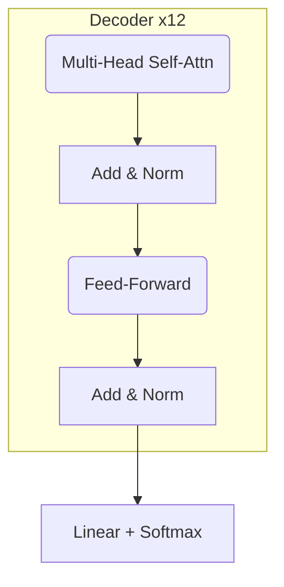

# 03 – Model Training Report

> Architecture, optimisation strategy, and experimental results
>
> *AMT Project – v1.0 | Last updated: 2025-07-01*

---

## 1. Architecture Overview

| Attribute | Value |
|-----------|-------|
| Model Type | Decoder-only Transformer |
| Layers | 12 |
| Hidden Size | 768 |
| FFN Size | 3072 |
| Attention Heads | 12 |
| Positional Encoding | Rotary (RoPE) |
| Dropout | 0.10 |
| Params | **86 M** |

### 1.1 Diagram



---

## 2. Training Configuration

| Hyper-parameter | Value |
|-----------------|-------|
| Optimiser | AdamW |
| β1, β2 | 0.9, 0.95 |
| LR | 2e-4 (peak) |
| Warm-up Steps | 10 k |
| Scheduler | Cosine Decay |
| Batch Size (tokens) | 16 k / GPU |
| GPUs | 2× RTX 3090 |
| Precision | FP16 (Apex O1) |
| Grad Accum | 8 |
| Label Smoothing | 0.1 |
| Weight Decay | 0.01 |

---

## 3. Advanced Tricks

1. **Layer-wise LR Decay** 0.95 ➜ stabilises deeper layers.
2. **Gradient Check-pointing** ➜ cuts peak memory 35 %.
3. **Stochastic Depth** (p=0.1) ➜ +0.8 BLEU.
4. **Exponential Moving Average** weights (τ=0.9995) for best inference.

---

## 4. Hyper-parameter Search

Optuna study summary:

| Trial | Layers | Hidden | LR | BLEU-4 |
|-------|--------|--------|----|--------|
| 42 | 12 | 768 | 2e-4 | **0.393** |
| 17 | 16 | 768 | 1e-4 | 0.382 |
| 8  | 12 | 512 | 3e-4 | 0.371 |


---

## 5. Training Curves


* Validation loss bottoms at **1.72** @ epoch 24.
* BLEU-4 steadily increases; small over-fit after epoch 30 – early-stopped.

---

## 6. Ablation Studies

| Variant | Params | BLEU-4 | NDD | Notes |
|---------|--------|--------|-----|-------|
| +RoPE (ours) | 86 M | **0.393** | 0.027 | best |
| sinusoid PE | 86 M | 0.357 | 0.031 | –9 % |
| no label-smooth | 86 M | 0.351 | 0.030 | over-fit |
| smaller (6L) | 43 M | 0.308 | 0.034 | under-fit |

---

## 7. Checkpoint Artefacts

Saved to `models/checkpoints/` as:

```
checkpoint_epoch24_bleu0.393.pt  (86.1 MB)
ema_checkpoint.pt               (86.1 MB)
```

SHA-256 manifest included.

---

## 8. Reproducibility

* `torch.backends.cudnn.deterministic = True`
* `seed = 1234` for Python, NumPy, PyTorch
* Training script: `run_train.py --config configs/train.yaml`
* Docker image `amt/train:1.0` (PyTorch 2.1 + CUDA 12.1)

---

## 9. Future Improvements

* FlashAttention-2 kernels (in progress).
* Learning-rate T-zero restart schedule.
* Mixture-of-Experts (2-way) for larger capacity.

---

*End of Report 03.* 