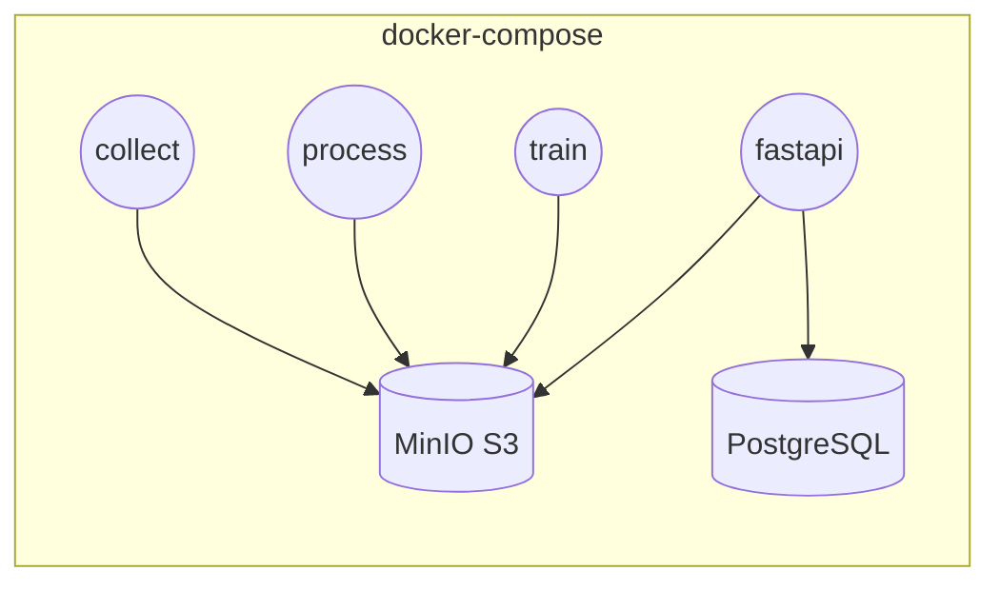
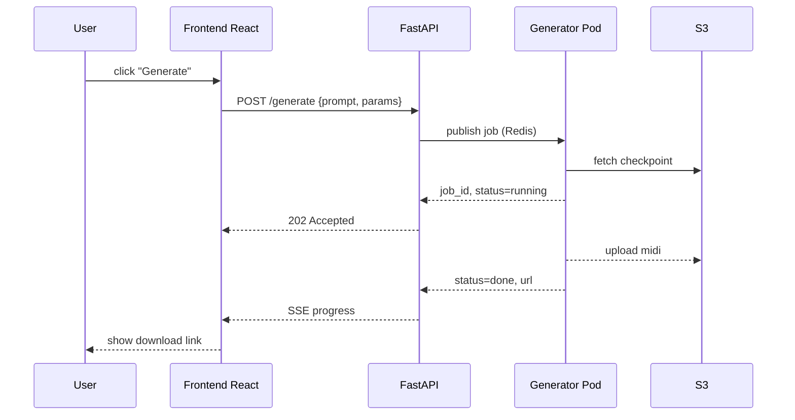

# 06 – System Architecture Report

> End-to-end software and infrastructure design
>
> *AMT Project – v1.0 | Last updated: 2025-07-01*

---

## 1. Component Breakdown

| Layer | Technology | Description |
|-------|------------|-------------|
| Data Collection | Python asyncio, `aiohttp` | Parallel HTTP downloads |
| Processing | PyTorch, spaCy | CPU/GPU feature extraction |
| Model Training | PyTorch Lightning | Distributed FP16 training |
| Inference API | FastAPI, Uvicorn | Exposes `/generate` endpoint |
| Storage | AWS S3 / local FS | MIDI artefacts & checkpoints |
| Orchestration | Docker Compose | Local dev multi-container |
| CI/CD | GitHub Actions | Lint + test + push image |

---

## 2. Container Topology

File `docker/docker-compose.yml` defines five services with distinct images, unified via shared `.env`.

---

## 3. Development vs Production

| Aspect | Dev (Compose) | Prod (K8s) |
|--------|---------------|------------|
| Orchestrator | docker-compose | EKS Kubernetes |
| Scalability | manual | HPA auto-scale |
| Storage | Local volumes | EFS + S3 |
| Logging | stdout | CloudWatch + Loki |

---

## 4. Sequence Diagram (Generation)

---

## 5. Security & Compliance

* **Rate limiting** – 10 req/min per IP (FastAPI middleware).
* **Auth** – JWT Bearer for private endpoints.
* **Licensing** – All generated MIDI released under CC-BY.
* **Data Privacy** – No personal data stored; S3 buckets encrypted with SSE-S3.

---

## 6. Monitoring & Observability

* **Prometheus** – metrics on GPU utilisation, latency.
* **Grafana** – dashboards (`docker/grafana/provisioning/`).
* **Loki** – central log aggregation.

Alert: P99 latency > 4 s triggers Slack webhook.

---

## 7. Future Enhancements

* Canary deployments for new checkpoints.
* GPU auto-scaling via Karpenter.
* Multi-tenant quotas.

---

*End of Report 06.* 