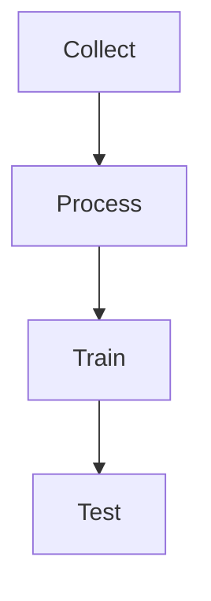

# 06_SYSTEM_ARCHITECTURE_REPORT.md

## 1. Kiến trúc tổng thể

```
Collect → Process → Train → Test
```

- Mỗi module là một package độc lập, runner script riêng.
- Dữ liệu luân chuyển qua các file JSON, MIDI, checkpoint.

## 2. Sơ đồ pipeline



## 3. Mô tả module
- **Collect:** Thu thập, chuẩn hóa dữ liệu, metadata, pairing.
- **Process:** Xử lý, trích xuất đặc trưng, chuẩn hóa, chia batch.
- **Train:** Huấn luyện mô hình, lưu checkpoint, log.
- **Test:** Sinh nhạc, đánh giá, so sánh, benchmark.

## 4. Data flow
- Dữ liệu gốc: `data/midi/`, `data/text/`
- Output collect: `data/output/`
- Output process: `data/processed/`
- Checkpoint: `models/checkpoints/`
- Output test: `test_results/`

## 5. Điểm mạnh
- Module hóa, dễ bảo trì, mở rộng.
- Dữ liệu luân chuyển rõ ràng, không phụ thuộc cứng.
- Dễ tích hợp thêm module mới.

## 6. Hướng mở rộng
- Hỗ trợ multi-modal (audio, image, ...).
- Tích hợp cloud, distributed training.
- Xây dựng API, web UI. 