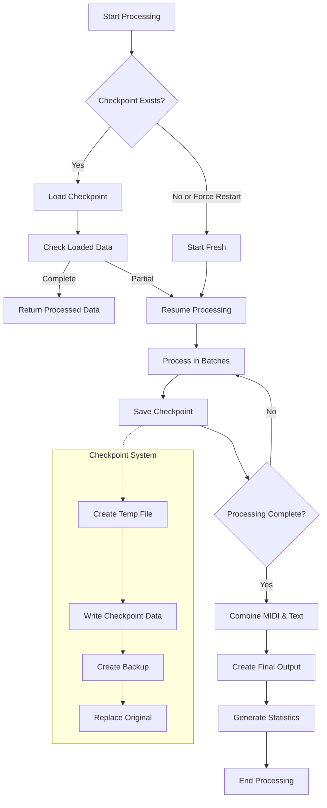

# Optimized Checkpoint System

The AMT project includes an optimized checkpoint system for reliable processing of large datasets. The system allows you to easily pause and resume processing without data loss, with robust error handling and detailed progress tracking.

## System Overview

The diagram below illustrates the checkpoint system workflow:



## Features

- **Robust Checkpoint Saving**: Temporary files and backups ensure checkpoint integrity
- **Detailed Progress Tracking**: Comprehensive statistics on processing progress  
- **Multiple Resume Options**: Continue from where you left off or force restart
- **Partial Results**: Option to save partially processed data
- **Error Recovery**: Gracefully handles errors during processing
- **Performance Metrics**: Processing speed and estimated time remaining

## Usage

### Continue Processing from Checkpoint

To continue processing from a checkpoint, use either the `continue_from_checkpoint.py` script or `process.py` with the `continue` mode:

```bash
# Using the dedicated script
python continue_from_checkpoint.py --use_gpu --use_cache

# Using process.py
python process.py --mode continue --use_gpu --use_cache
```

### Advanced Options

```bash
python continue_from_checkpoint.py \
  --midi_checkpoint data/processed/midi_checkpoint.json \
  --text_checkpoint data/processed/text_checkpoint.json \
  --input_file data/output/paired_data.json \
  --output_dir data/processed \
  --workers 8 \
  --use_gpu \
  --use_cache \
  --log_level info \
  --checkpoint_interval 5 \
  --batch_size 64 \
  --save_partial
```

### Command-line Arguments

| Argument | Description |
|----------|-------------|
| `--midi_checkpoint` | Path to MIDI checkpoint file |
| `--text_checkpoint` | Path to text checkpoint file |
| `--processing_checkpoint` | Path to legacy processing checkpoint file (optional) |
| `--input_file` | Path to original paired data file |
| `--output_dir` | Output directory for processed data |
| `--workers` | Number of parallel workers (default: 4) |
| `--use_gpu` | Use GPU for text processing if available |
| `--use_cache` | Use caching to speed up processing |
| `--log_level` | Logging level (debug, info, warning, error, critical) |
| `--checkpoint_interval` | Save checkpoint after processing this many batches (default: 10) |
| `--batch_size` | Batch size for processing (default: 32) |
| `--force_restart` | Force restart processing from beginning |
| `--save_partial` | Save partial results even if processing is incomplete |

## Checkpoint File Format

Checkpoint files use a standard JSON format with the following structure:

```json
{
  "processed_data": [...],
  "last_processed_idx": 123,
  "total_files": 500,
  "timestamp": "2023-05-20T15:30:45.123456",
  "batch_info": {
    "current_batch": 5,
    "total_batches": 20,
    "batch_size": 32,
    "processing_time": 120.5,
    "files_per_second": 2.3
  }
}
```

## Common Scenarios

### Resuming After an Error

If processing was interrupted due to an error, simply run the continue command again:

```bash
python continue_from_checkpoint.py --use_gpu --use_cache
```

The system will automatically detect the last successfully processed items and continue from there.

### Force Restart Processing

If you need to restart processing from scratch (e.g., after making changes to processing algorithms):

```bash
python continue_from_checkpoint.py --force_restart --use_gpu --use_cache
```

### Save Partial Results

If you want to save partially processed data for analysis or testing:

```bash
python continue_from_checkpoint.py --save_partial --use_gpu --use_cache
```

## Tips for Large Datasets

1. Always use `--use_cache` to avoid reprocessing files
2. Use `--checkpoint_interval` to control how often checkpoints are saved
3. For very large datasets, use smaller batch sizes (e.g., `--batch_size 16`)
4. Increase `--workers` on systems with many CPU cores
5. Use `--use_gpu` when processing text with BERT embeddings 