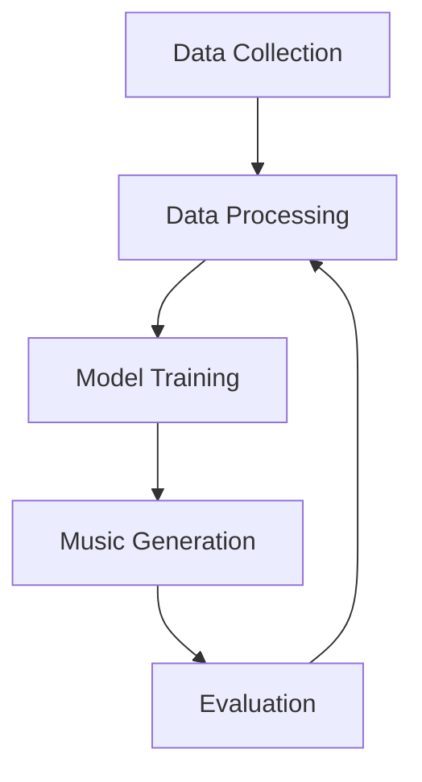
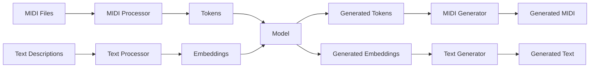

# Architecture

## System Architecture

The AMT system is designed with modularity and extensibility in mind. It consists of several key components that work together to provide a complete solution for music transcription and generation.

### High-Level Architecture

### Component Breakdown

#### Data Collection

The data collection module is responsible for:

- Collecting MIDI files from various sources
- Collecting text descriptions of music
- Pairing MIDI files with their corresponding text descriptions

Key components:
- `MIDICollector`: Collects and organizes MIDI files
- `TextCollector`: Collects and organizes text descriptions
- `DataPairing`: Pairs MIDI files with text descriptions

#### Data Processing

The data processing module transforms raw data into a format suitable for model training:

- MIDI processing: Converts MIDI files into token sequences
- Text processing: Converts text descriptions into embeddings
- Data preparation: Creates training, validation, and test datasets

Key components:
- `MIDIProcessor`: Processes MIDI files into tokens
- `TextProcessor`: Processes text into embeddings
- `DataPreparer`: Prepares datasets for training

#### Model Training

The model training module handles:

- Model definition: Defines the transformer architecture
- Training loop: Manages the training process
- Checkpointing: Saves model checkpoints during training
- Evaluation: Evaluates model performance during training

Key components:
- `MusicTransformer`: The core transformer model
- `Trainer`: Manages the training process
- `TrainingLoop`: Handles the training loop logic

#### Music Generation

The generation module uses the trained model to:

- Generate MIDI from text descriptions
- Generate text descriptions from MIDI
- Create variations of existing music

Key components:
- `Generator`: Generates music or text based on inputs
- `MIDIGenerator`: Specialized generator for MIDI output
- `TextGenerator`: Specialized generator for text output

#### Evaluation

The evaluation module assesses the quality of the model's outputs:

- Objective metrics: Quantitative measures of performance
- Subjective evaluation: Tools for human evaluation
- Comparison with baselines: Comparison with other approaches

Key components:
- `Evaluator`: Evaluates model outputs
- `Metrics`: Calculates performance metrics
- `Tester`: Runs comprehensive test suites

## Data Flow

The following diagram illustrates the data flow through the system:

## Configuration System

AMT uses a centralized configuration system based on Pydantic's BaseSettings:

- Configuration can be set via environment variables, config files, or code
- All settings are validated for type safety
- Sensible defaults are provided for all settings

For more details on configuration, see the [Configuration Guide](../usage/configuration.md).

## Next Steps

- Learn about the [Model](model.md) architecture in detail
- Follow the [Installation Guide](../usage/installation.md) to get started
- See the [API Reference](../api/index.md) for detailed documentation of each component 