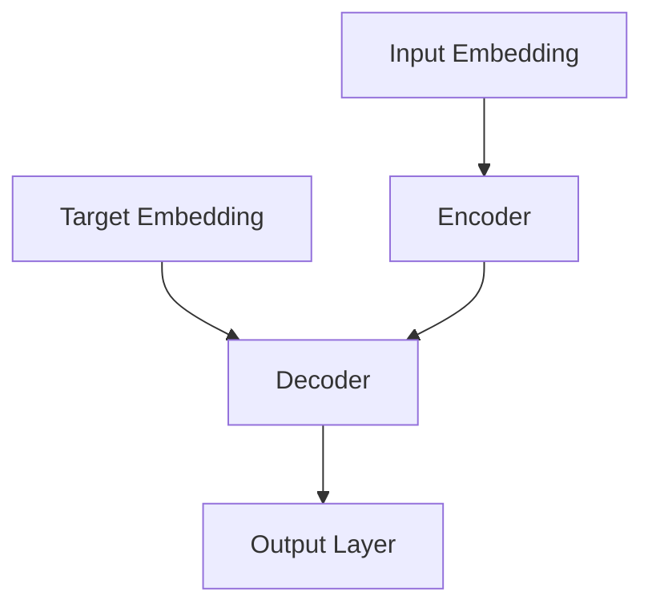

# Model

## Model Architecture

AMT uses a transformer-based architecture for music transcription and generation. The model is designed to handle both MIDI token sequences and text embeddings, enabling bidirectional conversion between music and text.

### Transformer Architecture

The core of the AMT model is a transformer architecture with an encoder-decoder structure:



#### MusicTransformer

The `MusicTransformer` class is a unidirectional transformer designed primarily for text-to-MIDI generation:

```python
class MusicTransformer(nn.Module):
    def __init__(self, 
                vocab_size: int, 
                d_model: int = 512, 
                nhead: int = 8,
                num_encoder_layers: int = 6,
                num_decoder_layers: int = 6,
                dim_feedforward: int = 2048,
                dropout: float = 0.1,
                max_sequence_length: int = 1024,
                text_embedding_dim: int = 768):
        # ...
```

Key components:
- **Token Embedding**: Embeds MIDI tokens into a continuous space
- **Text Projection**: Projects text embeddings to the model dimension
- **Positional Encoding**: Adds positional information to the embeddings
- **Encoder**: Processes the input (text embeddings)
- **Decoder**: Generates the output (MIDI tokens) based on the encoder output

#### MusicTextTransformer

The `MusicTextTransformer` class is a bidirectional transformer that can handle both text-to-MIDI and MIDI-to-text conversion:

```python
class MusicTextTransformer(nn.Module):
    def __init__(self, 
                vocab_size: int, 
                d_model: int = 512, 
                nhead: int = 8,
                num_layers: int = 6,
                dim_feedforward: int = 2048,
                dropout: float = 0.1,
                max_sequence_length: int = 1024,
                text_embedding_dim: int = 768):
        # ...
```

This model can operate in two modes:
- **Text-to-MIDI**: Generates MIDI tokens from text embeddings
- **MIDI-to-Text**: Generates text embeddings from MIDI tokens

## Tokenization

### MIDI Tokenization

MIDI files are tokenized into a sequence of events:

1. **Note On**: Represents the start of a note with a specific pitch
2. **Note Off**: Represents the end of a note with a specific pitch
3. **Time Shift**: Represents a time delay
4. **Velocity**: Represents the velocity (loudness) of a note

These events are then converted to integer tokens for model input.

### Text Embeddings

Text descriptions are processed using a pre-trained language model to generate embeddings. These embeddings capture the semantic meaning of the text and are used as input to the model.

## Training

The model is trained using a combination of:

- **Cross-Entropy Loss**: For text-to-MIDI generation
- **MSE Loss**: For MIDI-to-text generation

The training process uses teacher forcing, where the model is provided with the correct previous tokens during training.

## Generation

During generation, the model uses various decoding strategies:

- **Greedy Decoding**: Always selects the most probable next token
- **Beam Search**: Maintains multiple candidate sequences
- **Sampling**: Samples from the probability distribution of next tokens
- **Top-K Sampling**: Samples from the K most probable next tokens
- **Top-P (Nucleus) Sampling**: Samples from the smallest set of tokens whose cumulative probability exceeds P

## Model Parameters

The default model configuration uses:

- **Vocabulary Size**: Variable based on the tokenization scheme
- **Model Dimension**: 512
- **Number of Attention Heads**: 8
- **Number of Encoder/Decoder Layers**: 6
- **Feedforward Dimension**: 2048
- **Dropout Rate**: 0.1
- **Maximum Sequence Length**: 1024

These parameters can be adjusted in the configuration settings.

## Next Steps

- See the [API Reference](../api/train.md) for detailed documentation of the model classes
- Learn about [Training](../usage/training.md) the model
- Explore [Generation](../usage/generation.md) techniques 