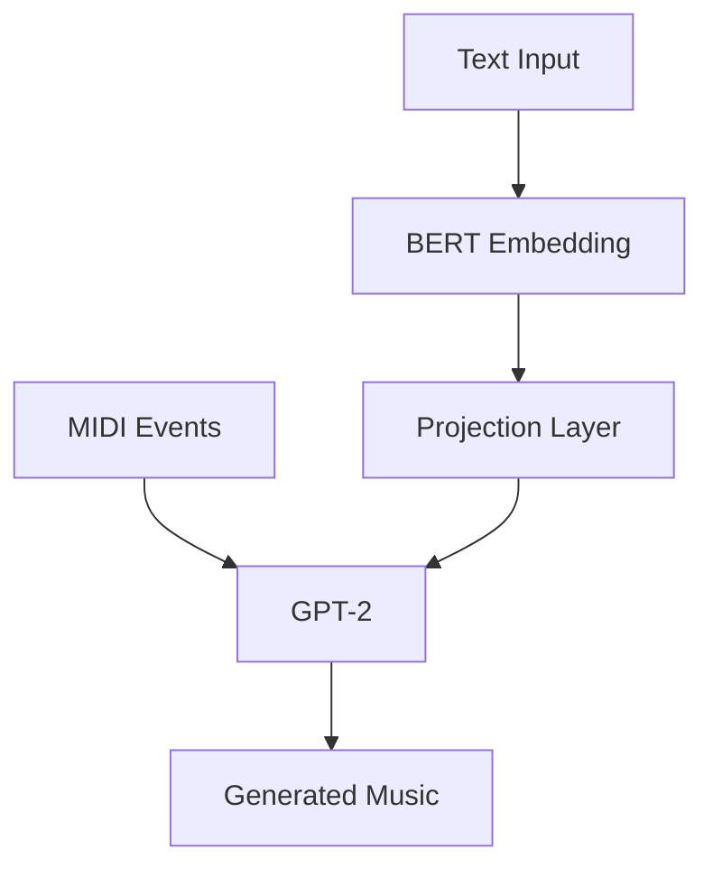
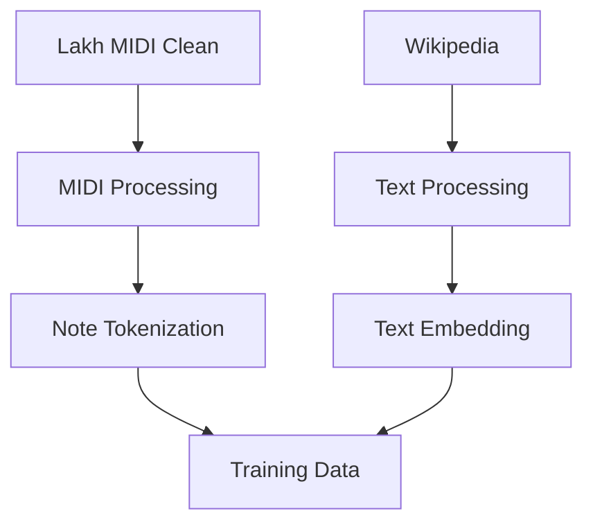

# Bài thuyết trình 01: AMT (Audio Music Transformer)
## Ý tưởng, Động lực, Giải pháp và Bộ dữ liệu

## 1. Giới thiệu

### 1.1. Tổng quan về AMT
- AMT (Audio Music Transformer) là một hệ thống tạo nhạc tự động dựa trên mô tả văn bản
- Sử dụng kiến trúc Transformer kết hợp BERT và GPT-2
- Chuyển đổi mô tả văn bản thành âm nhạc MIDI

### 1.2. Mục tiêu
- Tạo ra âm nhạc từ mô tả văn bản
- Hỗ trợ nhiều thể loại nhạc
- Tạo nhạc với nhiều nhạc cụ
- Đánh giá chất lượng âm nhạc
- Phân cụm MIDI files

## 2. Động lực

### 2.1. Vấn đề hiện tại
- Thiếu công cụ tạo nhạc tự động từ mô tả văn bản
- Khó khăn trong việc chuyển đổi ý tưởng thành âm nhạc
- Giới hạn trong việc tạo nhạc đa dạng
- Thiếu hệ thống đánh giá chất lượng âm nhạc

### 2.2. Giải pháp hiện có
- Các công cụ tạo nhạc truyền thống
- Các mô hình AI đơn giản
- Các hệ thống không hỗ trợ đa dạng thể loại
- Thiếu tích hợp xử lý ngôn ngữ tự nhiên

### 2.3. Nhu cầu thị trường
- Nhu cầu tạo nhạc tự động ngày càng tăng
- Yêu cầu về chất lượng và đa dạng
- Cần công cụ dễ sử dụng
- Đòi hỏi tính linh hoạt cao

## 3. Giải pháp đề xuất

### 3.1. Kiến trúc hệ thống

### 3.2. Các thành phần chính
1. **BERT Encoder**
   - Xử lý mô tả văn bản
   - Tạo text embeddings
   - Architecture: BERT-base-uncased
   - Embedding dimension: 768

2. **GPT-2 Decoder**
   - Tạo chuỗi sự kiện MIDI
   - Architecture: GPT-2
   - Hidden dimension: 1024
   - 6 layers, 8 attention heads

3. **Projection Layer**
   - Kết nối BERT và GPT-2
   - Input: 768 dimensions
   - Output: 1024 dimensions
   - Activation: Linear

### 3.3. Pipeline xử lý dữ liệu

## 4. Bộ dữ liệu

### 4.1. MIDI Data
- **Nguồn**: Lakh MIDI Clean dataset
- **Đặc điểm**:
  - Chất lượng cao
  - Đa dạng thể loại
  - Nhiều nhạc cụ
  - Metadata đầy đủ

### 4.2. Text Data
- **Nguồn**: Wikipedia
- **Đặc điểm**:
  - Mô tả âm nhạc
  - Thông tin thể loại
  - Mô tả nhạc cụ
  - Cảm xúc và phong cách

### 4.3. Xử lý dữ liệu
1. **MIDI Processing**
   - Extract metadata
   - Convert to event sequence
   - Analyze MIDI features

2. **Text Processing**
   - Preprocess text
   - Extract keywords
   - Create embeddings

3. **Data Preparation**
   - Combine data
   - Validate data
   - Store in JSON format

## 5. Tiến độ hiện tại

### 5.1. Đã hoàn thành
- Nghiên cứu và phân tích yêu cầu
- Thiết kế kiến trúc hệ thống
- Lựa chọn công nghệ và framework
- Chuẩn bị môi trường phát triển

### 5.2. Đang thực hiện
- Thu thập và xử lý dữ liệu MIDI
- Thu thập và xử lý dữ liệu text
- Phát triển các module xử lý dữ liệu
- Thiết kế và triển khai model

### 5.3. Kế hoạch tiếp theo
- Hoàn thiện xử lý dữ liệu
- Phát triển và huấn luyện model
- Đánh giá và tối ưu hiệu suất
- Tích hợp và kiểm thử hệ thống

## 6. Thách thức và giải pháp

### 6.1. Thách thức
1. **Dữ liệu**
   - Chất lượng và số lượng dữ liệu
   - Đa dạng thể loại và phong cách
   - Xử lý và chuẩn hóa dữ liệu

2. **Model**
   - Kiến trúc phức tạp
   - Yêu cầu tài nguyên cao
   - Tối ưu hiệu suất

3. **Đánh giá**
   - Metrics đánh giá chủ quan
   - So sánh với âm nhạc tham chiếu
   - Đảm bảo chất lượng

### 6.2. Giải pháp
1. **Dữ liệu**
   - Sử dụng Lakh MIDI Clean dataset
   - Thu thập text từ Wikipedia
   - Xử lý và chuẩn hóa dữ liệu

2. **Model**
   - Sử dụng BERT và GPT-2
   - Tối ưu kiến trúc
   - Sử dụng mixed precision

3. **Đánh giá**
   - Phát triển metrics khách quan
   - So sánh với dataset tham chiếu
   - Đánh giá từ người dùng

## 7. Kết luận

### 7.1. Tóm tắt
- Đã xác định rõ mục tiêu và phạm vi
- Đã thiết kế kiến trúc hệ thống
- Đã chuẩn bị dữ liệu và môi trường
- Đang tiến hành phát triển

### 7.2. Hướng tiếp theo
- Hoàn thiện xử lý dữ liệu
- Phát triển và huấn luyện model
- Đánh giá và tối ưu
- Tích hợp và kiểm thử

### 7.3. Kỳ vọng
- Tạo ra hệ thống tạo nhạc hiệu quả
- Đáp ứng nhu cầu người dùng
- Mở rộng tính năng và ứng dụng
- Đóng góp cho cộng đồng 