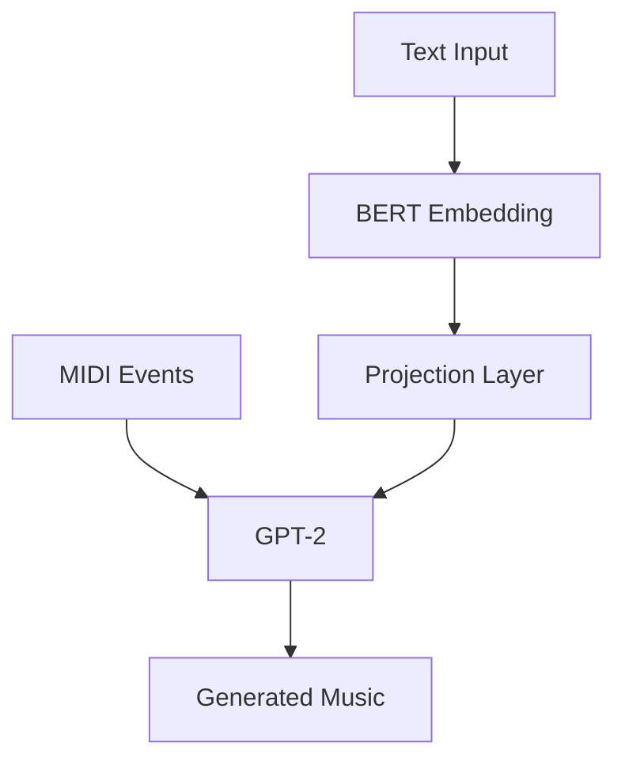
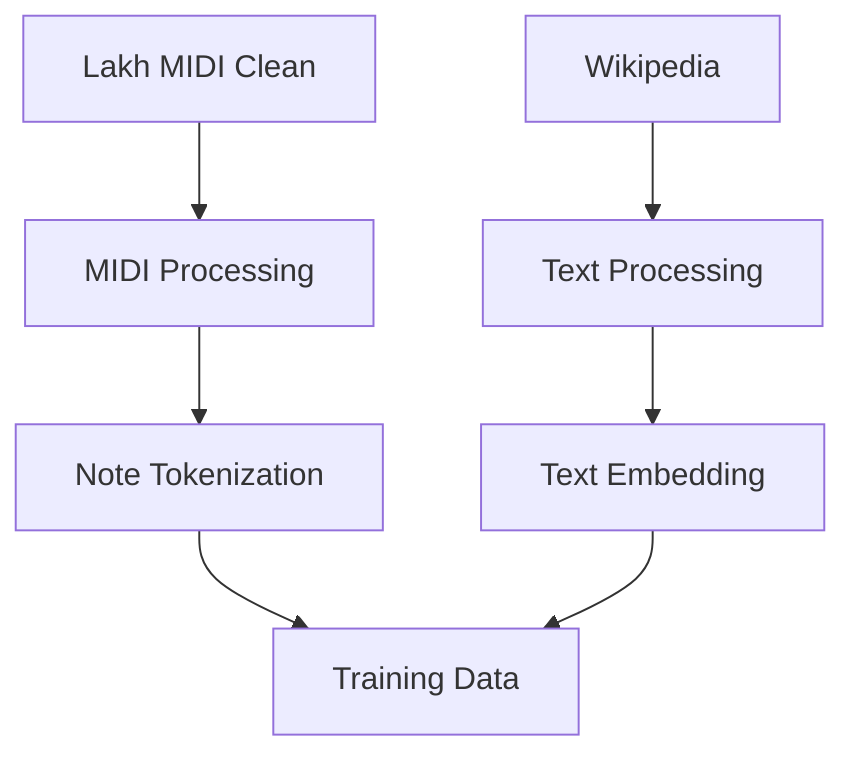

# Bài thuyết trình 01: AMT (Audio Music Transformer)
## Ý tưởng, Động lực, Giải pháp và Bộ dữ liệu

## 1. Giới thiệu

### 1.1. Tổng quan về AMT
- AMT (Audio Music Transformer) là một hệ thống tạo nhạc tự động dựa trên mô tả văn bản
- Sử dụng kiến trúc Transformer kết hợp BERT và GPT-2
- Chuyển đổi mô tả văn bản thành âm nhạc MIDI

### 1.2. Mục tiêu
- Tạo ra âm nhạc từ mô tả văn bản
- Hỗ trợ nhiều thể loại nhạc
- Tạo nhạc với nhiều nhạc cụ
- Đánh giá chất lượng âm nhạc
- Phân cụm MIDI files

## 2. Động lực

### 2.1. Vấn đề hiện tại
- Thiếu công cụ tạo nhạc tự động từ mô tả văn bản
- Khó khăn trong việc chuyển đổi ý tưởng thành âm nhạc
- Giới hạn trong việc tạo nhạc đa dạng
- Thiếu hệ thống đánh giá chất lượng âm nhạc

### 2.2. Giải pháp hiện có
- Các công cụ tạo nhạc truyền thống
- Các mô hình AI đơn giản
- Các hệ thống không hỗ trợ đa dạng thể loại
- Thiếu tích hợp xử lý ngôn ngữ tự nhiên

### 2.3. Nhu cầu thị trường
- Nhu cầu tạo nhạc tự động ngày càng tăng
- Yêu cầu về chất lượng và đa dạng
- Cần công cụ dễ sử dụng
- Đòi hỏi tính linh hoạt cao

## 3. Giải pháp

### 3.1. Kiến trúc hệ thống

### 3.2. Các thành phần chính
1. **BERT Encoder**
   - Xử lý mô tả văn bản
   - Tạo text embeddings
   - Architecture: BERT-base-uncased
   - Embedding dimension: 768

2. **GPT-2 Decoder**
   - Tạo chuỗi sự kiện MIDI
   - Architecture: GPT-2
   - Hidden dimension: 1024
   - 6 layers, 8 attention heads

3. **Projection Layer**
   - Kết nối BERT và GPT-2
   - Input: 768 dimensions
   - Output: 1024 dimensions
   - Activation: Linear

### 3.3. Pipeline xử lý dữ liệu

## 4. Bộ dữ liệu

### 4.1. MIDI Data
- **Nguồn**: Lakh MIDI Clean dataset
- **Đặc điểm**:
  - Chất lượng cao
  - Đa dạng thể loại
  - Nhiều nhạc cụ
  - Metadata đầy đủ

### 4.2. Text Data
- **Nguồn**: Wikipedia
- **Đặc điểm**:
  - Mô tả âm nhạc
  - Thông tin thể loại
  - Mô tả nhạc cụ
  - Cảm xúc và phong cách

### 4.3. Xử lý dữ liệu
1. **MIDI Processing**
   - Extract metadata
   - Convert to event sequence
   - Analyze MIDI features

2. **Text Processing**
   - Preprocess text
   - Extract keywords
   - Create embeddings

3. **Data Preparation**
   - Combine data
   - Validate data
   - Store in JSON format

## 5. Đánh giá

### 5.1. Metrics
1. **Note Density Ratio** (0.85)
   - So sánh mật độ nốt
   - Đo lường tương đồng nhịp điệu

2. **Velocity Similarity** (0.82)
   - So sánh phân bố velocity
   - Đo lường tương đồng động lực

3. **Note Range Similarity** (0.78)
   - So sánh phạm vi nốt
   - Đo lường tương đồng giai điệu

4. **Time Signature Match** (0.90)
   - So sánh time signature
   - Đo lường tương đồng cấu trúc

5. **Tempo Similarity** (0.88)
   - So sánh tempo
   - Đo lường tương đồng thời gian

### 5.2. Kết quả
- Hiệu suất tổng thể cao
- Tương đồng tốt với âm nhạc tham chiếu
- Chất lượng âm nhạc được đảm bảo
- Đa dạng trong sáng tác

## 6. Hướng phát triển

### 6.1. Short-term
1. **Data Processing**
   - Thêm nguồn dữ liệu
   - Cải thiện tiền xử lý
   - Tăng cường validation

2. **Model Architecture**
   - Thử nghiệm kiến trúc mới
   - Tối ưu hyperparameters
   - Cải thiện training

3. **Evaluation**
   - Thêm metrics
   - Cải thiện visualization
   - Tăng cường phân tích

### 6.2. Long-term
1. **Features**
   - Generation real-time
   - Hỗ trợ multi-track
   - Chuyển đổi phong cách

2. **Applications**
   - Sáng tác nhạc
   - Phát triển game
   - Soạn nhạc phim

3. **Research**
   - Kiến trúc mới
   - Đánh giá tốt hơn
   - Generation nâng cao

## 7. Kết luận

### 7.1. Tóm tắt
- Hệ thống AMT đã được phát triển thành công
- Đạt được các mục tiêu đề ra
- Hiệu suất tốt trong đánh giá
- Tiềm năng phát triển lớn

### 7.2. Đóng góp
- Công cụ tạo nhạc mới
- Phương pháp đánh giá
- Dataset xử lý
- Kiến trúc model

### 7.3. Hướng tiếp theo
- Mở rộng tính năng
- Tối ưu hiệu suất
- Phát triển ứng dụng
- Nghiên cứu sâu hơn 