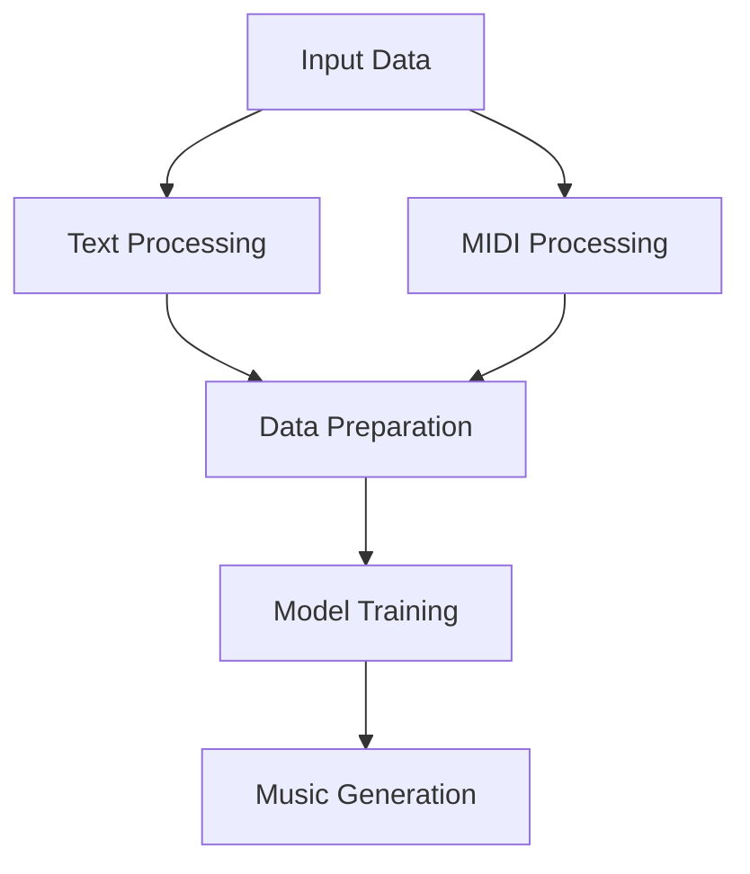

# Bài thuyết trình 01: AMT (Audio Music Transformer)

## 1. Giới thiệu
### 1.1. Tổng quan
- Hệ thống tạo nhạc tự động từ mô tả văn bản
- Sử dụng kiến trúc Transformer kết hợp BERT và GPT-2
- Chuyển đổi mô tả văn bản thành âm nhạc MIDI

### 1.2. Mục tiêu
- Tạo ra âm nhạc từ mô tả văn bản
- Hỗ trợ nhiều thể loại nhạc
- Tạo nhạc với nhiều nhạc cụ
- Đánh giá chất lượng âm nhạc
- Phân cụm MIDI files

## 2. Động lực
### 2.1. Vấn đề hiện tại
- Thiếu công cụ tạo nhạc tự động từ mô tả văn bản
- Khó khăn trong việc chuyển đổi ý tưởng thành âm nhạc
- Giới hạn trong việc tạo nhạc đa dạng
- Thiếu hệ thống đánh giá chất lượng âm nhạc

### 2.2. Giải pháp hiện có
- Các công cụ tạo nhạc truyền thống
- Các mô hình AI đơn giản
- Các hệ thống không hỗ trợ đa dạng thể loại
- Thiếu tích hợp xử lý ngôn ngữ tự nhiên

### 2.3. Nhu cầu thị trường
- Nhu cầu tạo nhạc tự động ngày càng tăng
- Yêu cầu về chất lượng và đa dạng
- Cần công cụ dễ sử dụng
- Đòi hỏi tính linh hoạt cao

## 3. Giải pháp đề xuất
### 3.1. Kiến trúc hệ thống tổng quan

### 3.2. Pipeline xử lý dữ liệu

#### 3.2.1. Text Processing
1. Text Preprocessing:
   - Chuyển đổi lowercase
   - Loại bỏ ký tự đặc biệt
   - Chuẩn hóa định dạng

2. Keyword Extraction:
   - Trích xuất từ khóa âm nhạc
   - Phân loại thể loại
   - Xác định nhạc cụ

3. BERT Processing:
   - Tokenization
   - Thêm special tokens
   - Tạo attention masks

#### 3.2.2. MIDI Processing
1. MIDI Parsing:
   - Đọc file MIDI
   - Trích xuất metadata
   - Phân tích tracks

2. Event Extraction:
   - Note on/off events
   - Control changes
   - Tempo changes

3. Note Tokenization:
   - Quantize time shifts
   - Tạo (TIME_ON, NOTE, DURATION) triplets

#### 3.2.3. Data Preparation
1. Batch Creation:
   - Padding sequences
   - Preparing labels
   - Data augmentation

2. Feature Engineering:
   - Text embeddings
   - MIDI features
   - Style features

#### 3.2.4. Model Training
1. Training Process:
   - Forward pass
   - Loss calculation
   - Backward pass
   - Model update

2. Optimization:
   - Optimizer: AdamW
   - Learning rate: 5e-5
   - Gradient clipping: 1.0

#### 3.2.5. Music Generation
1. Text Processing:
   - Text embedding generation
   - Context preparation
   - Temperature setting

2. Event Generation:
   - Autoregressive generation
   - Event sequence creation
   - Style consistency

3. MIDI Creation:
   - Event to MIDI conversion
   - Track creation
   - File saving

### 3.3. Model Architecture
1. BERT Encoder:
   - 12 transformer layers
   - 12 attention heads
   - Output: 768 dimensions

2. Projection Layer:
   - Chuyển đổi từ 768 sang 1024 dimensions
   - Dropout: 0.1

3. GPT-2 Decoder:
   - 6 transformer layers
   - 8 attention heads
   - Output: Generated MIDI events

## 4. Bộ dữ liệu
### 4.1. MIDI Data
- Nguồn: Lakh MIDI Clean dataset
- Đặc điểm:
  - Chất lượng cao
  - Đa dạng thể loại
  - Nhiều nhạc cụ
  - Metadata đầy đủ

### 4.2. Text Data
- Nguồn: Wikipedia
- Đặc điểm:
  - Mô tả âm nhạc
  - Thông tin thể loại
  - Mô tả nhạc cụ
  - Cảm xúc và phong cách

## 5. Tiến độ hiện tại
### 5.1. Đã hoàn thành
- Nghiên cứu và phân tích yêu cầu
- Thiết kế kiến trúc hệ thống
- Lựa chọn công nghệ

### 5.2. Đang thực hiện
- Thu thập và xử lý dữ liệu
- Phát triển các module
- Thiết kế model

### 5.3. Kế hoạch tiếp theo
- Hoàn thiện xử lý dữ liệu
- Phát triển và huấn luyện model
- Đánh giá và tối ưu

## 6. Thách thức và giải pháp
### 6.1. Thách thức về dữ liệu
- Chất lượng và số lượng
- Đa dạng thể loại
- Xử lý và chuẩn hóa

### 6.2. Thách thức về model
- Kiến trúc phức tạp
- Yêu cầu tài nguyên cao
- Tối ưu hiệu suất

### 6.3. Thách thức về đánh giá
- Metrics đánh giá chủ quan
- So sánh với âm nhạc tham chiếu
- Đảm bảo chất lượng

## 7. Kết luận
### 7.1. Tóm tắt
- Đã xác định rõ mục tiêu và phạm vi
- Đã thiết kế kiến trúc hệ thống
- Đã chuẩn bị dữ liệu và môi trường
- Đang tiến hành phát triển

### 7.2. Hướng tiếp theo
- Hoàn thiện xử lý dữ liệu
- Phát triển và huấn luyện model
- Đánh giá và tối ưu
- Tích hợp và kiểm thử 