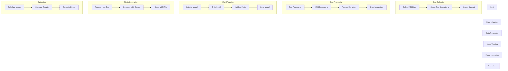

# Bài thuyết trình 01: AMT (Audio Music Transformer)

## 1. Giới thiệu
### 1.1. Tổng quan
- Hệ thống tạo nhạc tự động từ mô tả văn bản
- Sử dụng kiến trúc Transformer kết hợp BERT và GPT-2
- Chuyển đổi mô tả văn bản thành âm nhạc MIDI

### 1.2. Mục tiêu
- Tạo ra âm nhạc từ mô tả văn bản
- Hỗ trợ nhiều thể loại nhạc
- Tạo nhạc với nhiều nhạc cụ
- Đánh giá chất lượng âm nhạc
- Phân cụm MIDI files

## 2. Động lực
### 2.1. Vấn đề hiện tại
- Thiếu công cụ tạo nhạc tự động từ mô tả văn bản
- Khó khăn trong việc chuyển đổi ý tưởng thành âm nhạc
- Giới hạn trong việc tạo nhạc đa dạng
- Thiếu hệ thống đánh giá chất lượng âm nhạc

### 2.2. Giải pháp hiện có
- Các công cụ tạo nhạc truyền thống
- Các mô hình AI đơn giản
- Các hệ thống không hỗ trợ đa dạng thể loại
- Thiếu tích hợp xử lý ngôn ngữ tự nhiên

### 2.3. Nhu cầu thị trường
- Nhu cầu tạo nhạc tự động ngày càng tăng
- Yêu cầu về chất lượng và đa dạng
- Cần công cụ dễ sử dụng
- Đòi hỏi tính linh hoạt cao

## 3. Giải pháp đề xuất
### 3.1. Pipeline tổng thể

### 3.2. Chi tiết các bước xử lý

1. **Data Collection**
   - Thu thập MIDI files từ Lakh MIDI Clean dataset
   - Thu thập mô tả văn bản từ Wikipedia
   - Tạo dataset kết hợp MIDI và text

2. **Data Processing**
   - Text Processing:
     - Tiền xử lý văn bản
     - Trích xuất từ khóa
     - Tokenization với BERT
   
   - MIDI Processing:
     - Đọc và phân tích file MIDI
     - Trích xuất sự kiện (note on/off, control changes)
     - Token hóa các nốt nhạc
   
   - Feature Extraction:
     - Trích xuất đặc trưng từ text
     - Trích xuất đặc trưng từ MIDI
     - Kết hợp các đặc trưng
   
   - Data Preparation:
     - Tạo batch
     - Padding sequences
     - Chuẩn bị labels

3. **Model Training**
   - Khởi tạo model:
     - BERT encoder (12 layers, 12 heads)
     - Projection layer (768 -> 1024)
     - GPT-2 decoder (6 layers, 8 heads)
   
   - Training process:
     - Forward pass
     - Loss calculation
     - Backward pass
     - Model update
   
   - Validation:
     - Đánh giá trên validation set
     - Điều chỉnh hyperparameters
     - Lưu model tốt nhất

4. **Music Generation**
   - Xử lý input text:
     - Tạo text embeddings
     - Chuẩn bị context
     - Thiết lập temperature
   
   - Tạo MIDI events:
     - Autoregressive generation
     - Tạo chuỗi sự kiện
     - Đảm bảo tính nhất quán
   
   - Tạo file MIDI:
     - Chuyển đổi events thành MIDI
     - Tạo tracks
     - Lưu file

5. **Evaluation**
   - Tính toán metrics:
     - Note density ratio
     - Velocity similarity
     - Note range similarity
     - Time signature match
     - Tempo similarity
   
   - So sánh kết quả:
     - So với dataset tham chiếu
     - So với các model khác
     - Đánh giá chất lượng
   
   - Tạo báo cáo:
     - Tổng hợp kết quả
     - Phân tích điểm mạnh/yếu
     - Đề xuất cải thiện

### 3.3. Các module chính

1. **Data Processing Module**
   - MIDI processor
   - Text processor
   - Feature extractor
   - Data preparator

2. **Model Module**
   - BERT encoder
   - Projection layer
   - GPT-2 decoder
   - Training manager

3. **Generation Module**
   - Text processor
   - Event generator
   - MIDI creator
   - Output handler

4. **Evaluation Module**
   - Metrics calculator
   - Quality assessor
   - Performance analyzer
   - Report generator

## 4. Bộ dữ liệu
### 4.1. MIDI Data
- Nguồn: Lakh MIDI Clean dataset
- Đặc điểm:
  - Chất lượng cao
  - Đa dạng thể loại
  - Nhiều nhạc cụ
  - Metadata đầy đủ

### 4.2. Text Data
- Nguồn: Wikipedia
- Đặc điểm:
  - Mô tả âm nhạc
  - Thông tin thể loại
  - Mô tả nhạc cụ
  - Cảm xúc và phong cách

## 5. Tiến độ hiện tại
### 5.1. Đã hoàn thành
- Nghiên cứu và phân tích yêu cầu
- Thiết kế kiến trúc hệ thống
- Lựa chọn công nghệ

### 5.2. Đang thực hiện
- Thu thập và xử lý dữ liệu
- Phát triển các module
- Thiết kế model

### 5.3. Kế hoạch tiếp theo
- Hoàn thiện xử lý dữ liệu
- Phát triển và huấn luyện model
- Đánh giá và tối ưu

## 6. Thách thức và giải pháp
### 6.1. Thách thức về dữ liệu
- Chất lượng và số lượng
- Đa dạng thể loại
- Xử lý và chuẩn hóa

### 6.2. Thách thức về model
- Kiến trúc phức tạp
- Yêu cầu tài nguyên cao
- Tối ưu hiệu suất

### 6.3. Thách thức về đánh giá
- Metrics đánh giá chủ quan
- So sánh với âm nhạc tham chiếu
- Đảm bảo chất lượng

## 7. Kết luận
### 7.1. Tóm tắt
- Đã xác định rõ mục tiêu và phạm vi
- Đã thiết kế kiến trúc hệ thống
- Đã chuẩn bị dữ liệu và môi trường
- Đang tiến hành phát triển

### 7.2. Hướng tiếp theo
- Hoàn thiện xử lý dữ liệu
- Phát triển và huấn luyện model
- Đánh giá và tối ưu
- Tích hợp và kiểm thử 